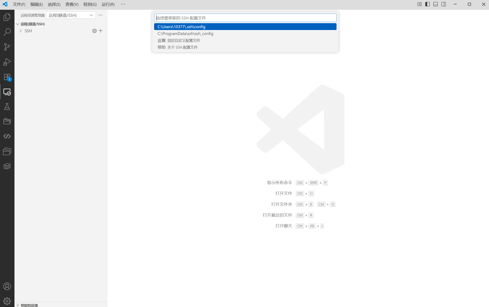

# 使用 SSH 连接服务器

本文档将帮助使用 macOS 系统的同学完成 SSH 密钥对的生成与配置，并连接到本课程提供的服务器环境进行实验。

## 1. SSH 简介

SSH（Secure Shell）是一种加密的网络传输协议，可以在不安全的网络中为网络服务提供安全的传输环境。通过使用 SSH，你可以安全地连接到远程服务器并执行命令。

> [!tip]
>
> **为什么需要 SSH 密钥？**
>
> - **安全性**：相比密码登录，SSH 密钥更加安全
> - **便利性**：配置完成后无需每次输入密码
> - **自动化**：支持脚本自动化操作

如果你好奇密钥是如何工作的，可以参考[这篇文章](https://www.ruanyifeng.com/blog/2011/08/what_is_a_digital_signature.html)。

## 2. 生成 SSH 密钥对

下面介绍常用的 RSA 算法加密和 Ed25519 算法加密两种 SSH 密钥对，分别命名为 `id_rsa`, `id_rsa.pub` 和 `id_ed25519`, `id_ed25519.pub` 文件。当今 SSH 协议规范通常推荐使用 Ed25519 算法加密，不过现阶段我们不需要区分这两种加密具体区别。如果你很好奇这两种加密方式的优劣性，可以参阅[这篇文章](https://nikk.is-a.dev/blog/ed25119_n_rsa/)

### 检查现有密钥

在生成新密钥之前，务必先检查是否已经存在 SSH 密钥：

```bash
ls ~/.ssh
```

如果目录不存在或为空，说明你还没有 SSH 密钥，可以继续下面的步骤。

> [!tip]
>
>如果你有 `id_rsa` 和 `id_rsa.pub` 文件（由 RSA 算法加密），或 `id_ed25519` 和 `id_ed25519.pub` 文件（由 Ed25519 算法加密），说明你已经有 SSH 密钥对了。可以移步到[向他人分享你的公钥](#向他人分享你的公钥)。

### 生成新的 Ed25519 密钥对

在终端中输入以下命令生成 SSH 密钥对：

```bash
ssh-keygen
```

> [!tip]
>
>在有些网站上，他们会宣称使用上面的方式生成了 RSA 密钥对，这是基于[比较老的SSH协议规范](https://www.rfc-editor.org/rfc/rfc4252)。自[OpenSSH 9.5](https://www.openssh.com/releasenotes.html#9.5)起，使用上述方法生成的密钥对默认是 Ed25519 加密的。

执行上述命令后，系统会提示你进行一系列配置。除非你有配置 passphrase 的需求并且知道自己在做什么，否则连按三个回车即可。

```bash
Enter file in which to save the key (/home/yourusername/.ssh/id_ed25519):
Enter passphrase (empty for no passphrase):
Enter same passphrase again:
```

### 验证密钥生成

密钥生成完成后，你可以查看生成的文件：

```bash
ls ~/.ssh
```

你应该能看到以下文件：

- `id_ed25519`：私钥文件（**请妥善保管，不要泄露**）
- `id_ed25519.pub`：公钥文件（可以安全地分享给服务器）

私钥和公钥统称为一组“密钥”或“密钥对”。

### 向他人分享你的公钥

在终端中运行下面的命令：

```bash
cat ~/.ssh/id_ed25519.pub
```

观察到输出为 `ssh-ed25519 xxxxxxxxxxxxxxx xxxxx@xxxx`，这就是你的公钥，可以复制并分享给他人。

### 生成新的 RSA 密钥对

在终端中输入以下命令生成 SSH 密钥对：

```bash
ssh-keygen -t rsa
```

执行上述命令后，系统会提示你进行一系列配置。除非你有配置 passphrase 的需求并且知道自己在做什么，否则连按三个回车即可。

```bash
Generating public/private rsa key pair.
Enter file in which to save the key (/home/kano/.ssh/id_rsa): 
Enter passphrase (empty for no passphrase): 
Enter same passphrase again: 
```

### 验证密钥生成

密钥生成完成后，你可以查看生成的文件：

```bash
ls ~/.ssh
```

你应该能看到以下文件：

- `id_rsa`：私钥文件（**请妥善保管，不要泄露**）
- `id_rsa.pub`：公钥文件（可以安全地分享给服务器）

私钥和公钥统称为一组“密钥”或“密钥对”。

### 向他人分享你的公钥

在终端中运行下面的命令：

```bash
cat ~/.ssh/id_rsa.pub
```

观察到输出为 `ssh-rsa xxxxxxxxxxxxxxx xxxxx@xxxx` ，这就是你的公钥，可以复制并分享给他人。

## 3. 重置密钥对

注意，本模块内容仅作为了解，供忘记了密码的同学参考以重置 SSH 密钥对。其他同学不需要执行。另外，如果在此处重置了 SSH 密钥对，你还需要在 GitHub 中重新上传新的 SSH 密钥对：

### 检查现有密钥

在删除密钥之前，务必先检查是否已经存在 SSH 密钥：

```bash
ls ~/.ssh
```

如果目录不存在或为空，说明你还没有 SSH 密钥，忽略这个模块吧~

### 删除密钥对

***使用 bash 命令删除文件需要非常小心，我们强烈建议你直接复制以下代码指令**

下面两种删除密钥对方式中只要选择一种操作即可：

- 重置 SSH （这将同时删除已存储的所有服务器信息和受信的公钥，不推荐）

```bash
rm -rf ~/.ssh/*
```

- 删除特定的 SSH 密钥对，使用

```bash
cd .ssh
dir
```

此时终端会显示 SSH 中存储的信息，例如：

```bash
id_rsa  id_rsa.pub  id_ed25519  id_ed25519.pub  known_hosts  known_hosts.old  authorized_keys
```

使用 `rm` 操作删除指定的密钥对，例如，删除 Ed25519 加密的密钥对：

```bash
rm ~/.ssh/id_ed25519
rm ~/.ssh/id_ed25519.pub
```

如果要删除 RSA 加密的密钥对，将上面的 `ed25519` 改为 `rsa` 即可。

### 生成 SSH 密钥对

参见[上文](#2-生成-ssh-密钥对)。

## 4. 使用 VS Code 的 Remote 插件进行远程开发

注意，下面的操作请在已经分配到服务器之后再执行。

### 安装 VS Code 插件


### 配置文件

- 在左侧找到形如电脑的图标
- 点击SSH旁边的齿轮
- 进入默认配置文件



### 连接服务器

- 点击SSH旁边的加号，新建远程
- 在图中所示方框中输入以下命令连接到服务器：

```bash
ssh root@服务器地址 -p 端口号
```


首次连接时，系统会显示服务器的指纹信息并询问是否信任：

```bash
The authenticity of host 'xxxxxxx' can't be established.
ECDSA key fingerprint is SHA256:xxxxxxxxxxxxxxxxxxxxxxxxxxxxxxxxxxxxxxx.
Are you sure you want to continue connecting (yes/no/[fingerprint])?
```

输入 `yes` 并按回车键继续。

如果配置正确，你应该能够成功登录到服务器而无需输入密码。
