# Lab0: GitLab

## 实验任务

- 下载与安装 Git
- 学习基本的 Git & GitHub 操作
- 加入 GitHub Classroom

## 前言：浅谈版本控制（Version Control）

假设你正在用 C++ 实现一个简易的学生成绩管理系统：

```shell
StudentGradeManagementSystem/
├── main.cpp
├── include/
│   ├── student.h
│   └── grade.h
├── src/
│   ├── student.cpp
│   └── grade.cpp
├── tests
│   └── test.cpp
└── docs/
    └── README.md
```

某一天，你灵机一动：如果我用 `unordered_map` 代替 `vector` 组织学生列表，这样查找某个学生的时间复杂度就从 $O(n)$ 降到了 $O(1)$ ，于是你开心地将项目重构了一遍。过了几天，当你想要将学生按照成绩排序时，你觉得应该改回 `vector`，但之前的文件已经被覆盖了，你不得不再重写一遍。

或许有同学养成了代码备份的好习惯——将重构前的文件保存为 `student_old.h`、`student_old.cpp`等等。但当类似的情景再次发生时，你的项目结构将变得相当混乱。

另一种情景是，假设你和 Zecyel 同学在协作这个项目，你们同时修改了 `main.cpp`，合并的时候只能将代码逐行对比，将他的部分代码复制进来。

### 什么是版本控制？

版本控制（Version Control）是一种用来记录文件内容的变化，并且能在以后回溯到特定版本的系统。

就像“保存历史记录”一样，它能帮我们：

- 保存每次修改（而不是只保留最新版本）
- 查看每次修改了什么
- 回退到任意一次修改
- 多人协作时合并修改

> [!note]
>
> - 你可以查看我们课程网页仓库的 [commit 历史](https://github.com/ICS-25Fall-FDU/ICS-25Fall-FDU.github.io/commits/main/)，这里记录了我们的每一次修改。
>
> - 我们在生活中使用软件的版本号（例如 `v1.98.2`）则是“发行版”。
>   - 例如我们使用的校园助手 App，在历经界面优化、接口修复等多次修改形成一个稳定、完整的版本后，才会打上标签（tag）发行。

## Git

Git 是一种分布式版本控制软件。

### 下载与安装

- [Windows](https://git-scm.com/downloads/win)

- [macOS](https://git-scm.com/downloads/mac)

- [Linux](https://git-scm.com/downloads/linux)

> [!tip]
>
> - 本学期的大部分实验都在 Linux 系统上完成，使用 Windows 系统的同学请在虚拟机安装 Git，使用服务器的同学请在服务器上安装 Git。
> - 检查安装是否成功。在虚拟机 / 服务器上输入 `git --version`，如果输出 `git version <版本号>`，则为安装成功。

### 配置

在 Git 中，`git config` 是用来配置 Git 行为和环境的命令。

> [!important]
>
> Git 每次提交都会记录“作者是谁”，需要配置用户名和邮箱：
>
> ```bash
> git config --global user.name "用户名"
> git config --global user.email "你的邮箱@example.com"
> ```

::: details
Git 的配置分为三个层级：

- 系统级（--system）：对整个系统所有用户生效，配置写在 `/etc/gitconfig`

- 用户级（--global）：对当前用户生效，配置写在 `~/.gitconfig`

- 项目级（默认）：仅对当前仓库生效，配置写在 `.git/config`

（优先级：项目级 > 用户级 > 系统级）

在本学期实验中，使用 `--global` 即可。

其他的 Git 配置（可选）：

```bash
# 默认分支名
git config --global init.defaultBranch main

# 别名

# 用 st 代表 status，以下类似 
git config --global alias.st status

git config --global alias.co checkout
git config --global alias.br branch
git config --global alias.cm "commit -m"

```

:::

### Git 基本操作

想要最低限度地使用 Git，以下的命令是必须掌握的。

- `git init`

  将本地项目初始化为一个 Git 仓库。如果你打开项目文件夹，会发现多出了一个 `.git` 文件夹。

- `git add`

  将指定的改动添加到暂存区，例如：

  ```bash
  # 假设你处于 `/StudentGradeManagementSystem` 目录下

  # 将 src 目录下的 student.cpp 添加到暂存区
  git add src/student.cpp

  # 将当前目录下（及其递归子目录）的所有改动添加到暂存区
  git add -A

  # 将当前目录下的所有后缀为 .cpp 的文件改动添加到暂存区（git add 支持字符串通配符）
  git add *.cpp
  ```

  > [!warning]
  >
  > 请一定注意你所在的目录！如果你在 `/src` 目录下执行 `git add -A`，那么 `/StudentGradeManagementSystem` 目录下其他的改动不会被添加到暂存区。
  >
  > ```bash
  > # 只暂存 /src 目录下的改动
  > user@linux:~/StudentGradeManagementSystem/src$ git add -A
  >
  > # 暂存整个项目的改动
  > user@linux:~/StudentGradeManagementSystem$ git add -A
  > ```

- `git commit`

  将暂存区的内容提交到本地仓库。

  `git commit` 一般有两种方式。

  1. `git commit -m "your commit message"` 直接在命令行写 commit message。
  2. `git commit` 执行后 Git 会打开默认编辑器，在这里可以写多行 commit message，适合对一次复杂的提交作详细描述。

:::tip
VS Code 原生集成了 Git，同时提供了一系列插件，例如 Git 提交树可视化插件 Git Graph。
  :::details 示例
  以下是在 VS Code 中使用 Git 的演示：

1. 创建一个空文件夹 `test-git`。
2. 点击左侧边栏中的 `源代码管理` 图标。
  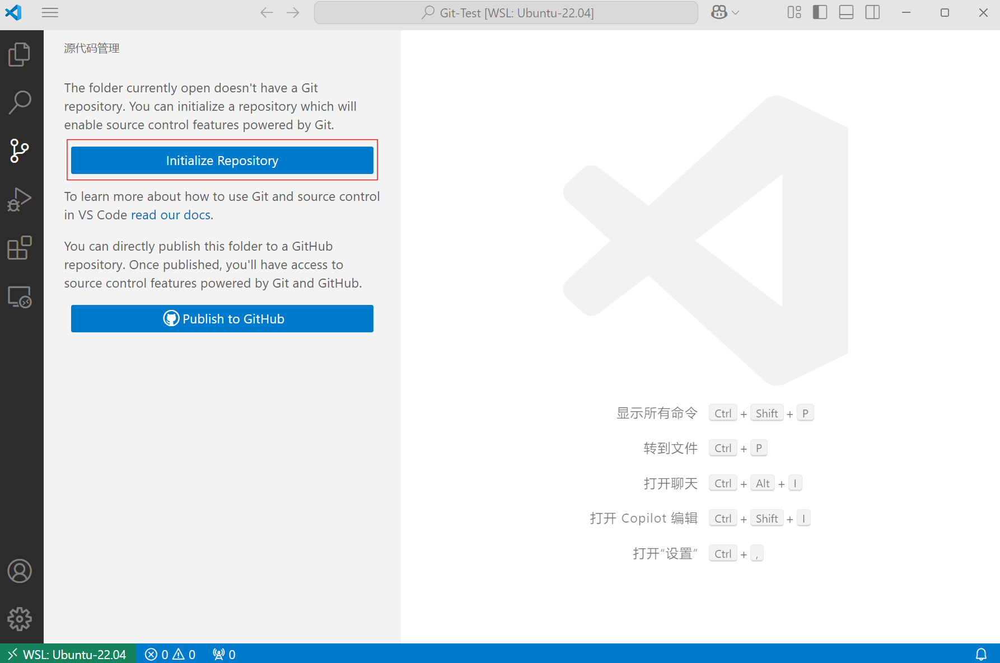

3. 点击 'Initialize Repository'（这一步等同于 `git init`）。
4. 新建 `main.cpp`，会出现 `U` 标记，意为 `Untracked（未跟踪的）`。
  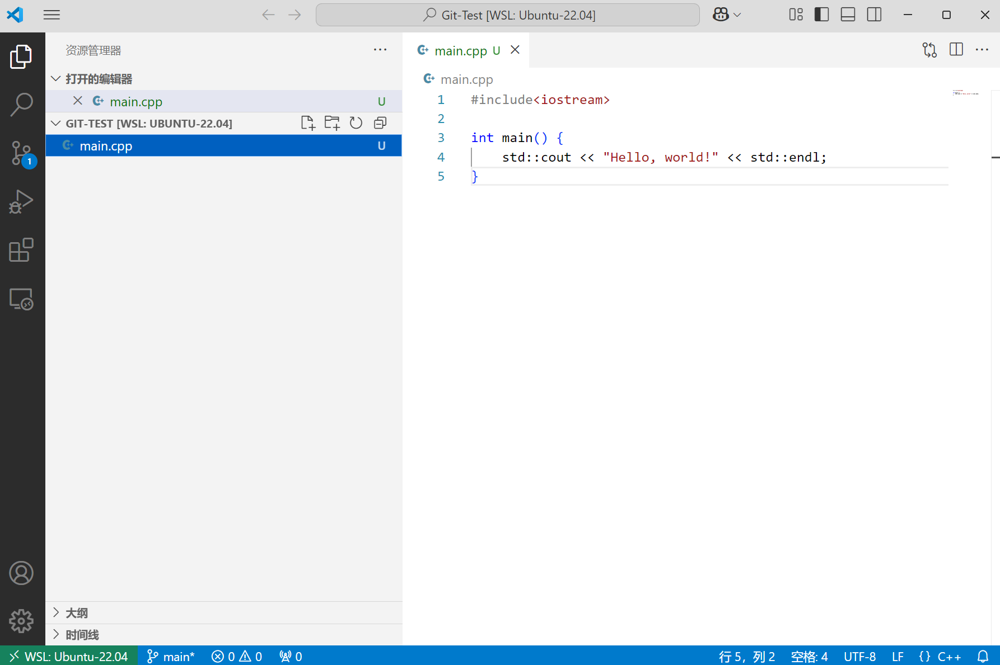

5. 回到 `源代码管理` 界面，这里有两个 `+` 按钮。
上方的 `+` 代表将项目中的所有更改添加到暂存区，相当于在项目目录下执行 `git add -A`。
下方的 `+` 代表将指定文件添加到暂存区，相当于执行 `git add main.cpp`。
  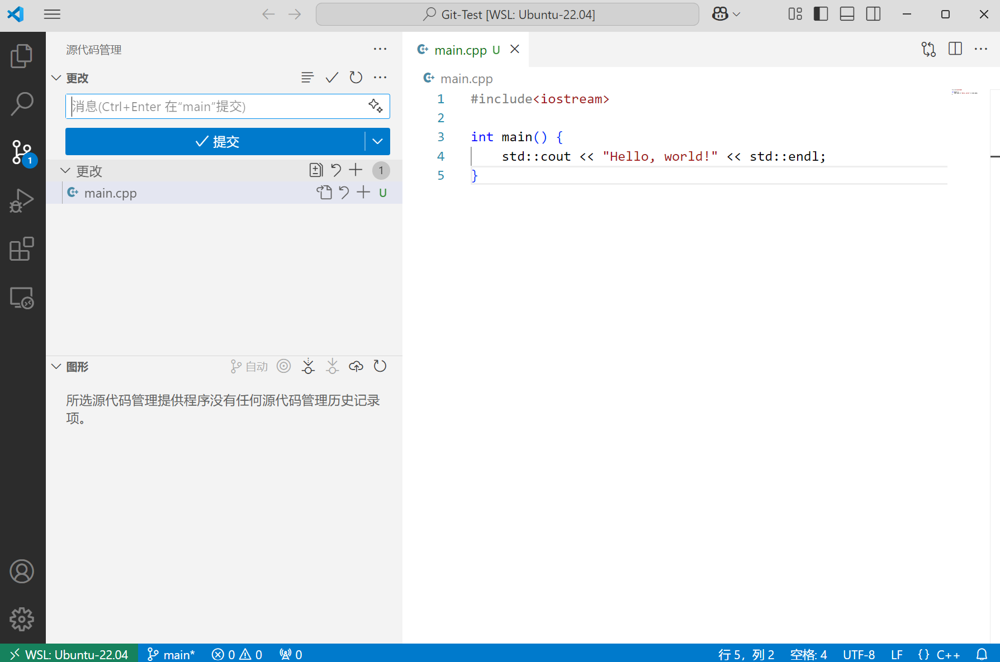

6. 点击上方的 `+`，`main.cpp` 的标记变为 `A`，意为 `Added（已暂存）`。
  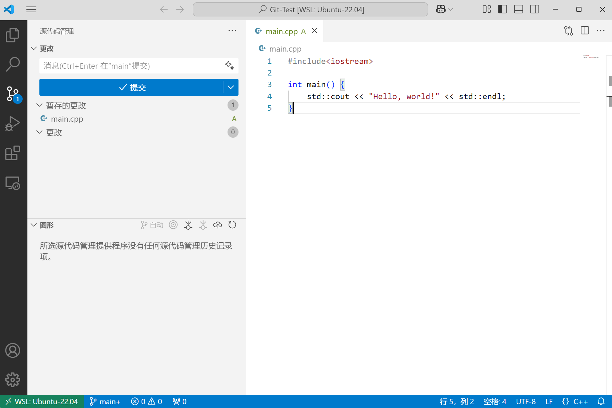

7. 在文本框输入 commit message（可以是多行），点击提交，相当于执行 `git commit -m "Initial commit"`
  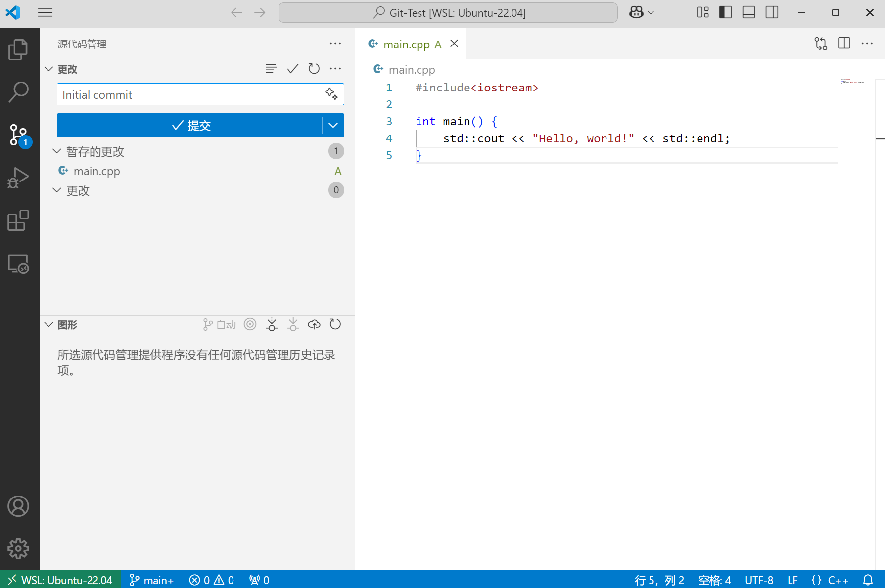

8. 修改 `main.cpp`。这时 `main.cpp` 的标记会变为 `M`，意为 `Modified（已修改）`
  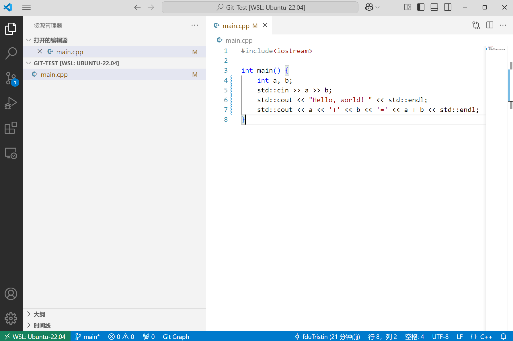

9. 重复上述暂存、提交操作。
  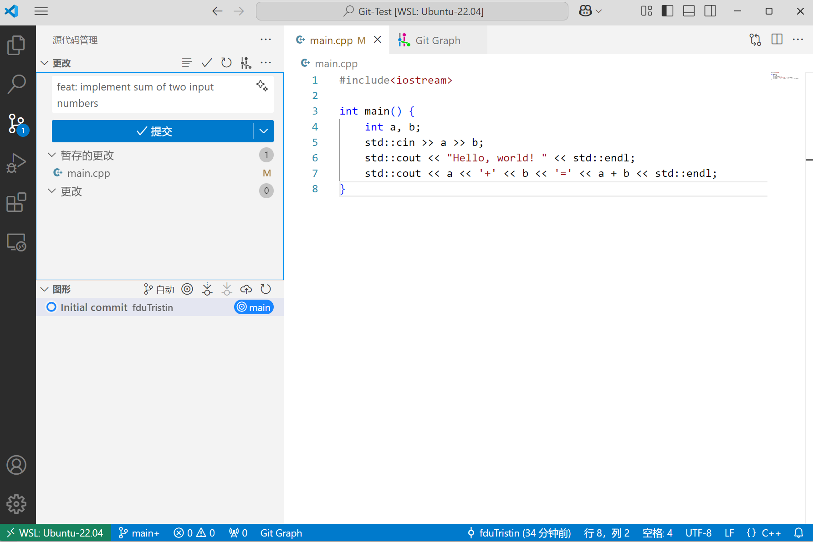

10. 点击下方的 `Git Graph`，可以查看 Git 提交树。
  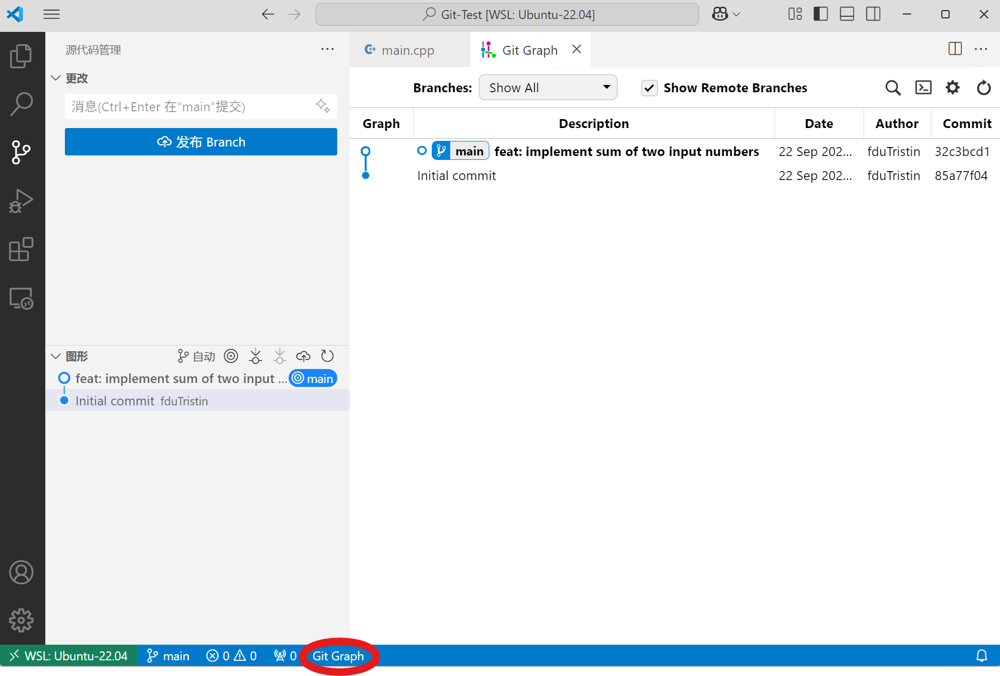

:::

### Git 进阶操作

此处会涉及一些和“分支管理”相关的 Git 操作。熟悉这些指令可以让你更好地管理你的代码分支。

- `git status`

  经常性地在运行 Git 命令前运行 `git status` 是个好习惯，它可以告诉你，你当前在哪个分支下，有哪些修改还未被暂存，有哪些暂存区的文件还没被提交。

  ```bash
  user@linux:~/test-git$ git status
  On branch main
  Changes to be committed:
    (use "git restore --staged <file>..." to unstage)
          new file:   tracked-file
  
  Untracked files:
    (use "git add <file>..." to include in what will be committed)
          untracked-file
  ```

- `git branch`

  可以使用 `git branch <branch-name>` 来从当前分支创建一个新的分支。注意，这不会将当前的代码分支切换到新创建的分支。

  例如，在 `main` 分支下运行 `git branch dev` 会创建一个 `dev` 分支（你可以使用 `git status` 查看！）。但是当前仍然会在 `main` 分支。

  如果你想查看当前有哪些分支，可以使用 `git branch` 或者 `git branch -a`。查阅资料并在报告中回答，这两条命令的区别是什么？

  ```bash
  user@linux:~/test-git$ git branch dev
  user@linux:~/test-git$ git branch
    dev
  * main
  user@linux:~/test-git$ git branch -a
    dev
  * main
  ```

- `git switch`

  可以使用 `git switch <branch-name>` 来切换到已经存在的分支。注意，你需要先保存你在当前分支上的所有文件，假如在当前分支上还有未 commit 的文件，那么这次 `git switch` 会失败。

  ```bash
  user@linux:~/test-git$ git switch dev
  Switched to branch 'dev'
  ```

- `git checkout`

  `git checkout` 曾经是使用最频繁的 Git 分支管理指令。但是现在，它的大部分功能已经被拆分到 `git branch` 和 `git switch` 了。我们仍在高频使用的 `git checkout` 指令只有 `git checkout -b <branch-name>`。此指令相当于 `git branch <branch-name> && git switch <branch-name>`，它可以从当前分支创建一个新的分支，并切换到这个分支。

- `git merge`

  `git merge` 用来把另一个分支的提交历史合并到当前分支。

  假设当前在 main 分支，你想合并 feature 分支：

  ```bash
  git checkout main
  git merge feature
  ```

  合并有两种常见的结果：

  1. Fast-forward 合并。如果 main 没有新的提交，只落后于 feature，执行 `git merge feature` 后 `main` 分支会直接“快进”到 `D`。

      ```bash
      main:    A---B
      feature: A---B---C---D
      ```

  2. 非 fast-forward 合并。如果两个分支各有提交：

      ```bash
      main:    A---B
                      \
      feature:         C---D
      ```

      执行 `git merge feature` 后 Git 会创建一个新的合并提交（merge commit）`E`：

      ```bash
      main:    A---B-------E
                      \   /
      feature:         C---D
      ```

  :::tip

  当两个分支修改了同一文件的同一位置，就会出现冲突（conflict），Git 无法自动合并。

  ```bash
  user@linux:~/test-git# git merge feature
  Auto-merging main.cpp
  CONFLICT (content): Merge conflict in main.cpp
  Automatic merge failed; fix conflicts and then commit the result.
  ```

  这时需要你手动修改文件处理冲突并提交。
  :::

## GitHub

GitHub 是一个 **基于 Git 的代码托管平台**，你可以将你的本地 Git 仓库上传为远程仓库，这样别人就可以拉取你的代码，与你进行协作。

### 配置

- 你需要注册一个 [GitHub](https://github.com/) 账户。

  > [!note]
  >
  > 注册 GitHub 的邮箱和你本地 `git config` 使用的邮箱最好一致，这样远程仓库的 commit 记录才能与你的 GitHub 账户对应上。当然，一个 GitHub 账户支持绑定多个邮箱，只要你 `git config` 中的邮箱包括在其中就没问题了。

- 在 Github 上配置 SSH 公钥

1. 复制 `cat ~/.ssh/id_rsa.pub` 输出的结果（即公钥）。
2. 打开 Github 并登录自己的账号。
3. 点击右上角头像，进入 Settings ：

    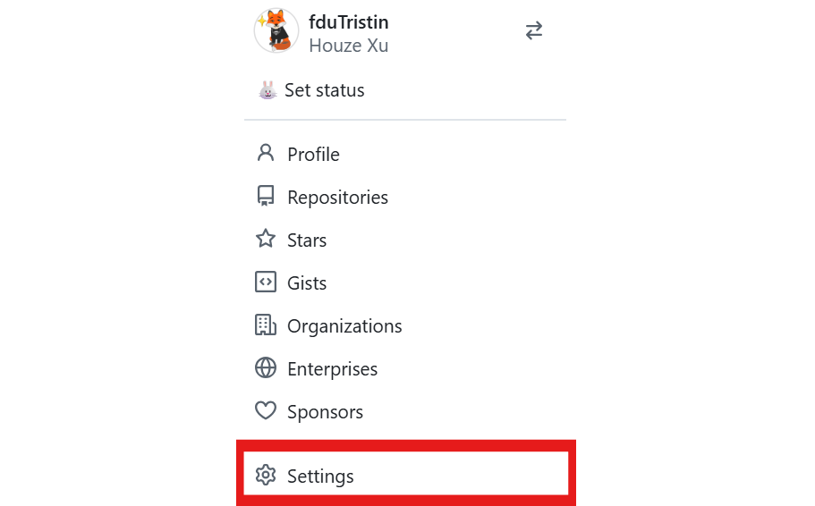

4. 进入页面后，在左侧选择 `SSH and GPG keys`, 在右侧点击 `New SSH Key`。

    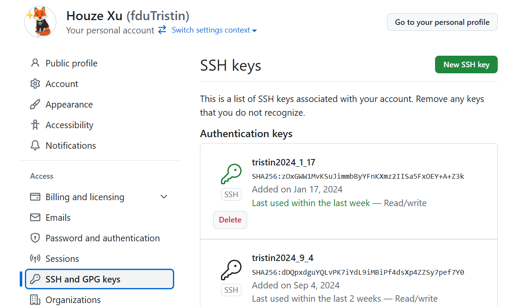

5. 在框中粘贴入自己复制的公钥，点击 `Add SSH key` 即可。

    > [!note]
    >
    > SSH key 的生成参考[这个文档](/appendix/ssh-server/#_2-生成-ssh-密钥对)
    >
    > 如果你在服务器上实验，需要在服务器上生成密钥对；如果在自己电脑的虚拟机上实验，需要在 wsl 中生成；如果你以后希望在本机拉取/上传 GitHub 仓库，则需要在本机生成密钥对。

6. 验证配置是否成功

```bash
user@linux:~# ssh -T git@github.com
Hi <用户名>! You've successfully authenticated, but GitHub does not provide shell access.
```

如果没有得到期望的输出，请检查密钥对配置，或参考[这个文档](/appendix/misc-qa)

### GitHub 基本操作

- `git clone`

  克隆远程仓库到本地。

  ```bash
  user@linux:~$ git clone <remote URL>
  ```

- `git pull`

  拉取最新的代码。这个操作相当于 `git fetch（将远程分支拉到本地）` + `git merge（将远程分支合并入本地分支）`

- `git push`

  将本地仓库的修改推送到远程仓库。

:::details 示例
如果你想修正我们课程网页上的错误，可以在 GitHub 点进我们的仓库，点击 `Code`，再选择 `SSH`，复制这串 URL。

  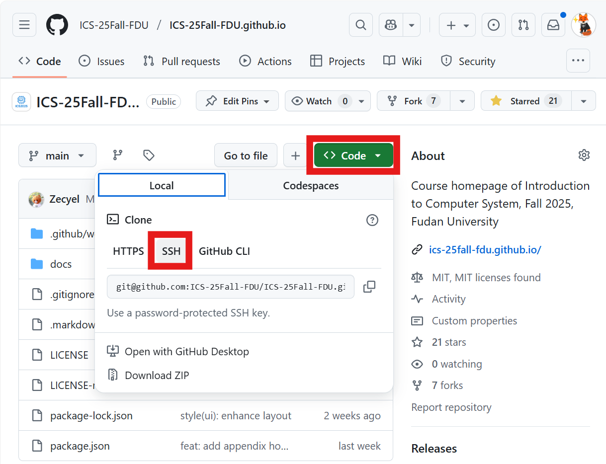

在终端运行 `git clone git@github.com:ICS-25Fall-FDU/ICS-25Fall-FDU.github.io.git`

```bash
user@linux:~# git clone git@github.com:ICS-25Fall-FDU/ICS-25Fall-FDU.github.io.git
Cloning into 'ICS-25Fall-FDU.github.io'...
remote: Enumerating objects: 893, done.
remote: Counting objects: 100% (48/48), done.
remote: Compressing objects: 100% (46/46), done.
remote: Total 893 (delta 15), reused 13 (delta 2), pack-reused 845 (from 1)
Receiving objects: 100% (893/893), 15.23 MiB | 239.00 KiB/s, done.
Resolving deltas: 100% (143/143), done.
```

下一个 lab 发布时，我们的网页仓库会有更新，需要运行 `git pull`

```bash
linux@user:~/ICS-25Fall-FDU.github.io# git pull
Updating 67568b7..10fcbcf
Fast-forward
 .gitignore                   |  3 +-
 docs/.vitepress/config/zh.ts |  3 +-
 docs/appendix/misc-qa.md     | 45 +++++++++++++++++++++++++++++
 3 files changed, 49 insertions(+), 2 deletions(-)
 create mode 100644 docs/appendix/misc-qa.md
```

如果你在本地仓库新增了 commit，你就可以 `git push`。当然，对于这个仓库你并没有 push 权限。你需要先 fork 该仓库，将本地修改 push 到你自己的仓库，然后向我们的仓库发起 pull request。
:::

## 加入 GitHub Classroom

1. 点击[这个链接](https://classroom.github.com/a/_QjXIaPr)接受第一份作业，你就加入了我们的[课程组织](https://github.com/orgs/ICS-25Fall-FDU)。

    > [!tip]
    >
    > 你需要登录 GitHub Classroom，请使用你的 GitHub 账户登录。
    >
    > 如果链接无法访问，请尝试使用 [Watt Toolkit](/appendix/watt_toolkit)，如果仍然无法访问请联系助教。

2. 你将跳转到以下界面：
  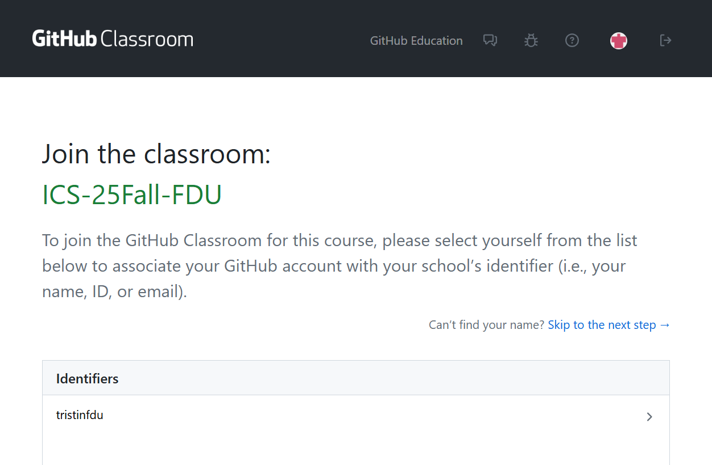

3. 选择你的名字。

    > [!warning]
    >
    > 请勿选择其他同学的名字，如果发现自己的名字已被使用请及时联系 [houzexu22@m.fudan.edu.cn](mailto:houzexu22@m.fudan.edu.cn)。

4. 点击 `Accept this assignment`
  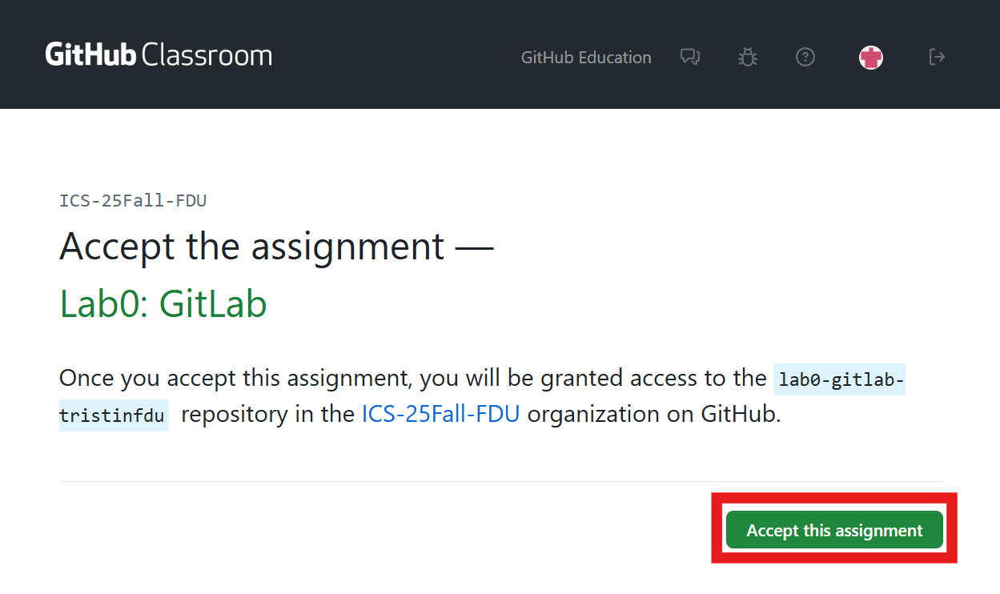

5. 你将看到以下界面，这里的 URL （形如`https://github.com/ICS-25Fall-FDU/lab0-gitlab-<username>`）就是你个人本次作业的远程仓库。
  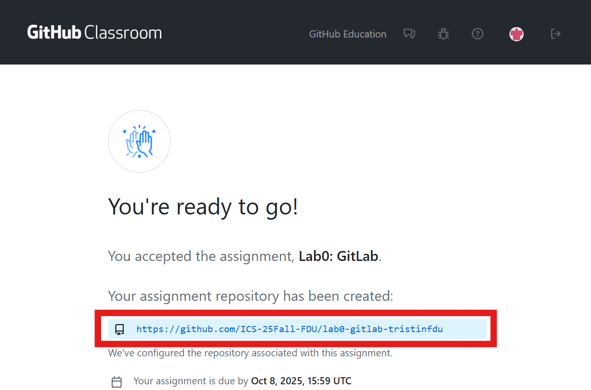

6. 点进远程仓库 URL 获取 remote URL（`git@github.com` 开头），这将是你 `git clone` 的 URL。
  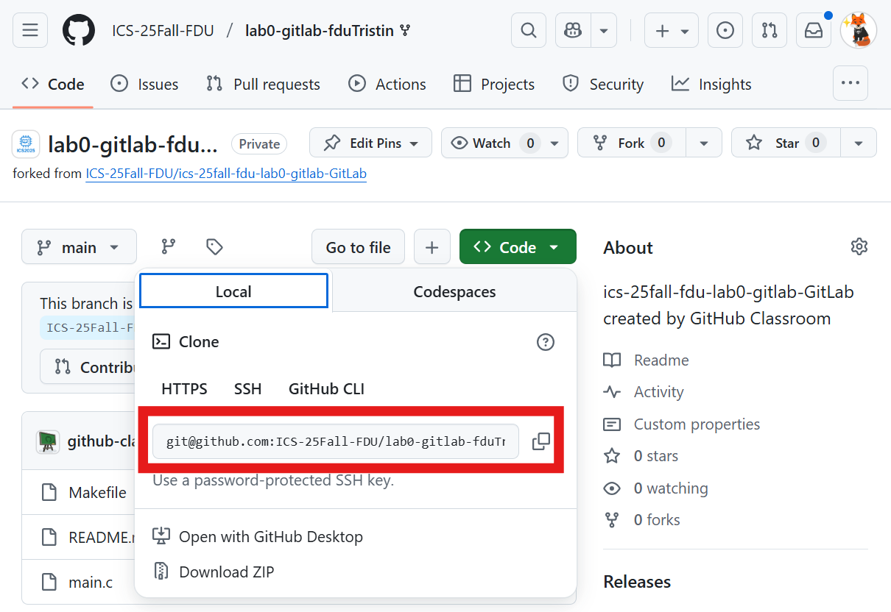

## 实验任务

1. 认真阅读文档，学习 Git 的基本用法。
2. 加入 GitHub Classroom。
3. 克隆你的个人远程仓库，完成 `main.c` 文件中的 `TODO` 部分并进行一次 commit。（50分）
    > [!info]
    >
    > 只要填入任意字符串就算完成，当然你也可以随意发挥（程序的正确性不纳入计分，有修改即可）。
    >
    > 如果你想要编译运行 `main.c`，执行
    >
    > ```bash
    > make 
    > ./main
    > make clean
    > ```

4. 学习 Git 分支管理，新建 `feature` 分支，在该分支以及 `main` 分支上对 `main.c` 分别进行一次修改与提交（10分）。

    随后将 `feature` 分支 merge 到 `main` 分支（即切换回 main 分支执行 `git merge feature`）。

    > [!important]
    >
    > 在两个分支上的提交需要满足：在 `main` 分支合并时会出现冲突。请你解决这个冲突，并在实验报告里截图表明你遇到并解决了冲突。（20分）
    > > [!tip]
    > > 请阅读 `git merge` 部分，思考如何修改 `main.c` 会出现冲突。
    > >
    > > 如果你两次提交之后合并没有出现冲突，不必担心，你可以重复提交与合并而不用撤回之前的提交，直到出现冲突并解决。

5. 在 `main` 分支提交一份实验报告（10分），格式要求为 `PDF` 或 `Markdown`。内容包括
    - 你的实验步骤
    - 必要的截图
    - 你的建议（可选）

    > [!tip]
    >
    > 这里的“提交”是指在文件夹内添加一个 PDF 或 Markdown 文件，然后 `git add -A && git commit`。
    >
    > 如果你是 Word 爱好者，请你将它导出为 PDF。
    >
    > 你可以在自己电脑上任一位置用 Word 写实验报告并导出，然后把 PDF 文件拖拽复制到 VS Code 编辑器左侧的目录下。
    > 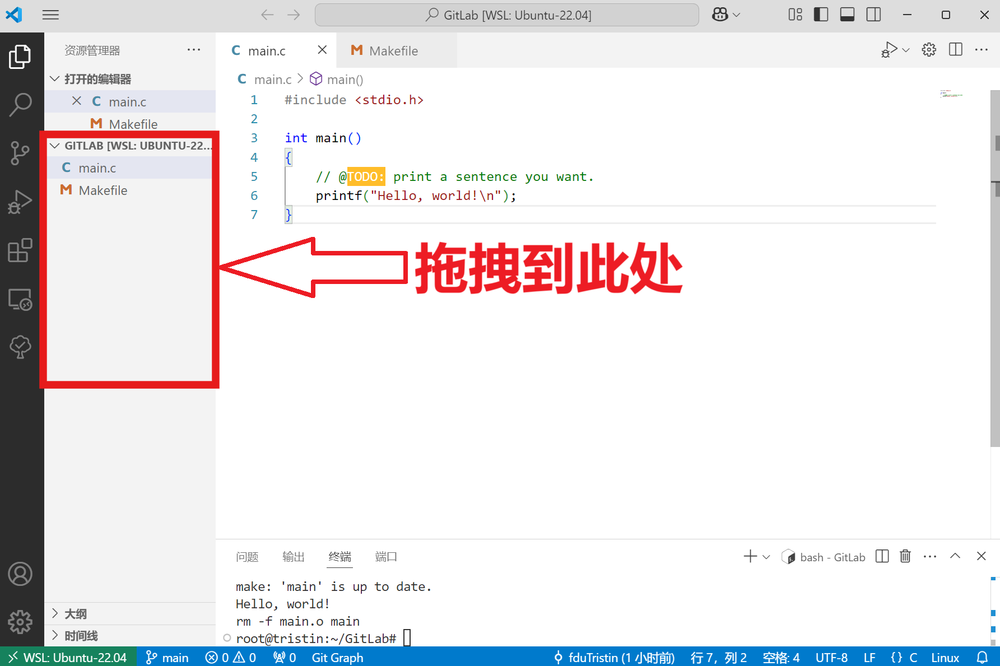

## 提交

**提交方式**：在本地仓库完成上述所有提交后，在 main 分支执行 `git push`（当然你也可以每提交一次就 push）。

**截止时间**：10 月 8 日 23:59。逾期将扣除部分分数。

> [!info] 写在最后的话
>
> 作为第一次作业，这个文档的字数过多，但实际的任务很少。如果你对 Git 感兴趣可以认真读完，甚至在网上寻找其他学习资源。
>
> 如果你觉得内容过于冗长，只需对照实验任务针对性地学习重点。完成后续实验最简单的流程就是 `git clone` -> 写完所有代码 -> `git add -A && git commit -m "xxx" && git push`。

## 学习资源

- [Pro Git](https://git-scm.com/book/en/v2)  /  [Pro Git中文版](https://git-scm.com/book/zh/v2)，推荐阅读1-3章
- [学习git的在线游戏](https://learngitbranching.js.org/)，挺好玩的
- [ohshitgit](https://ohshitgit.com/)，简短的介绍了如何从 Git 错误中恢复
- [Git for Computer Scientists](https://eagain.net/articles/git-for-computer-scientists/)，简短的介绍了 Git 的数据模型
- [git-from-the-bottom-up](https://jwiegley.github.io/git-from-the-bottom-up/)，详细的介绍了 Git 的实现细节
- [explain-git-in-simple-words](https://xosh.org/explain-git-in-simple-words/)，如其名
- [用动图展示10大Git命令](https://zhuanlan.zhihu.com/p/132573100)，一篇精美文章
