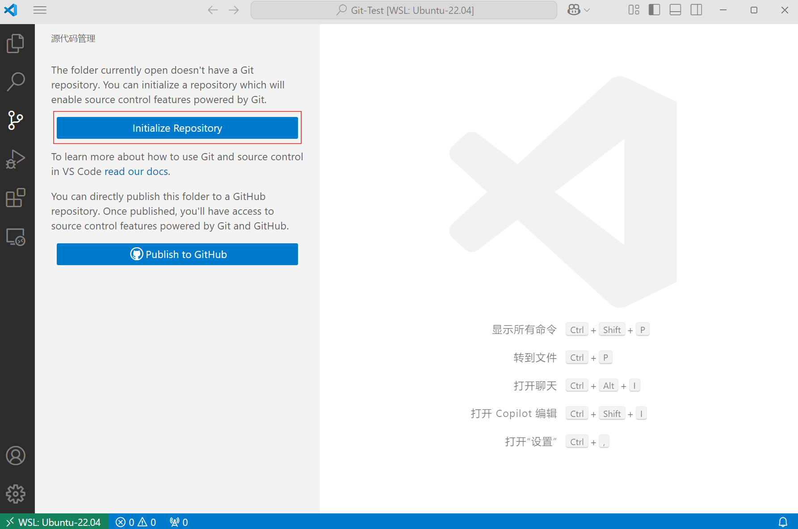
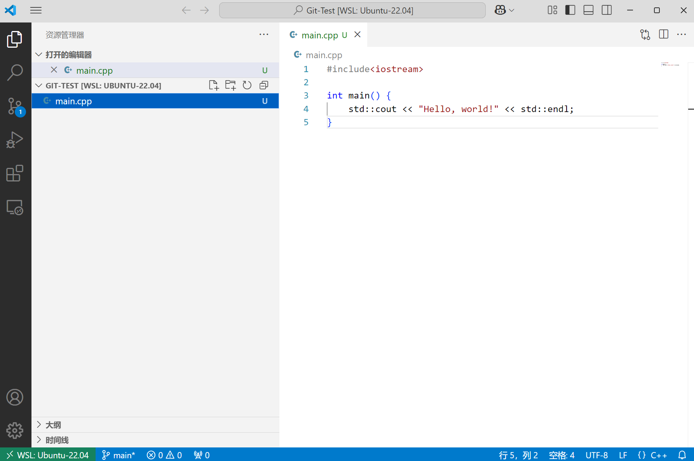
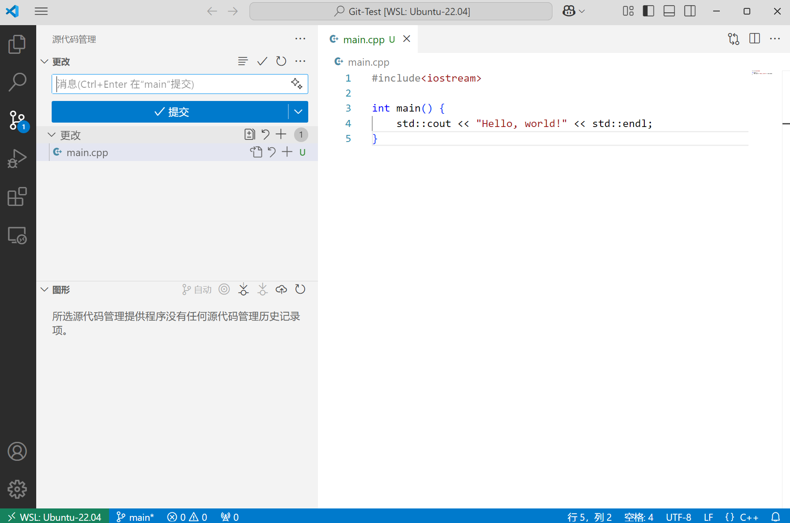
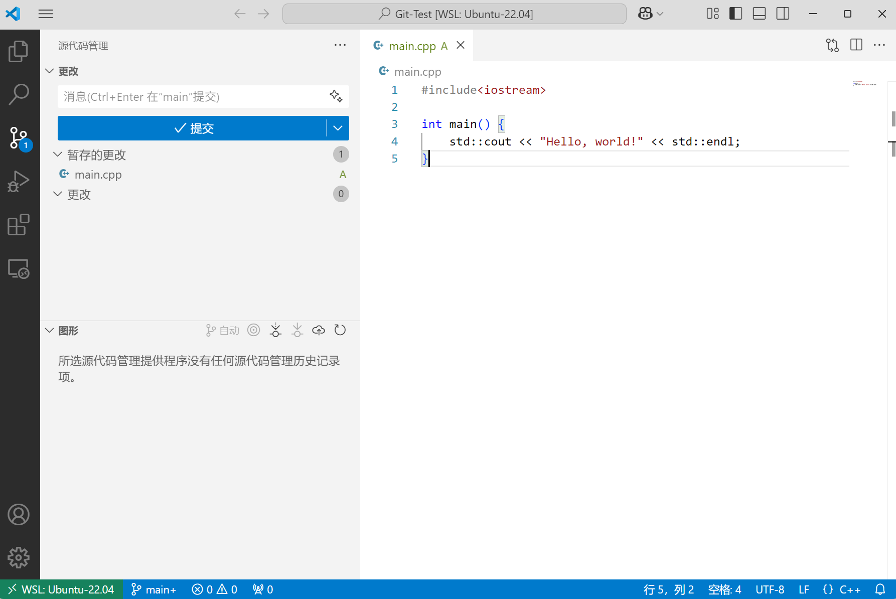
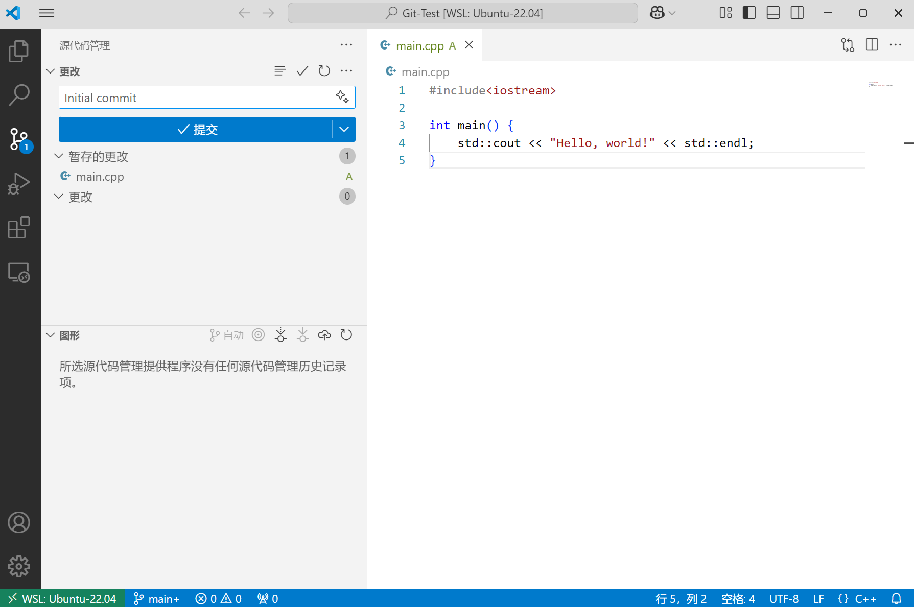
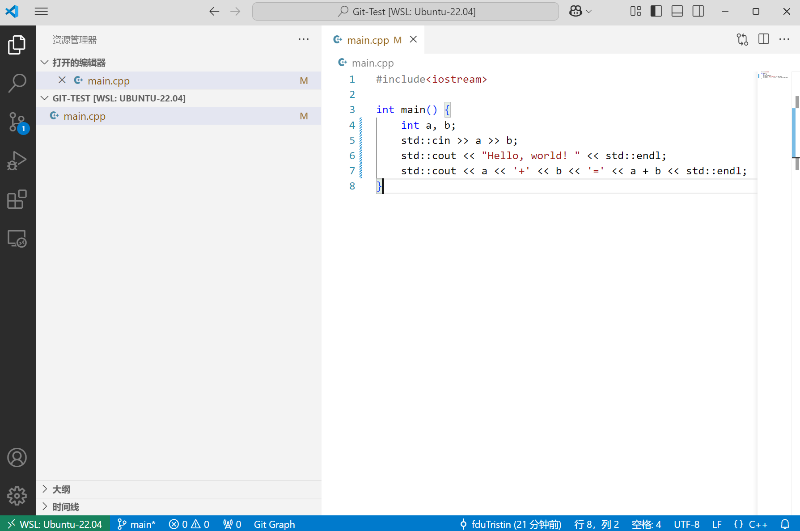
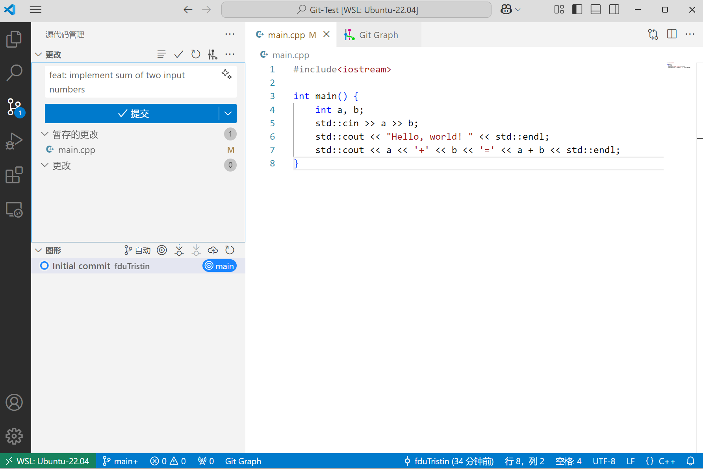
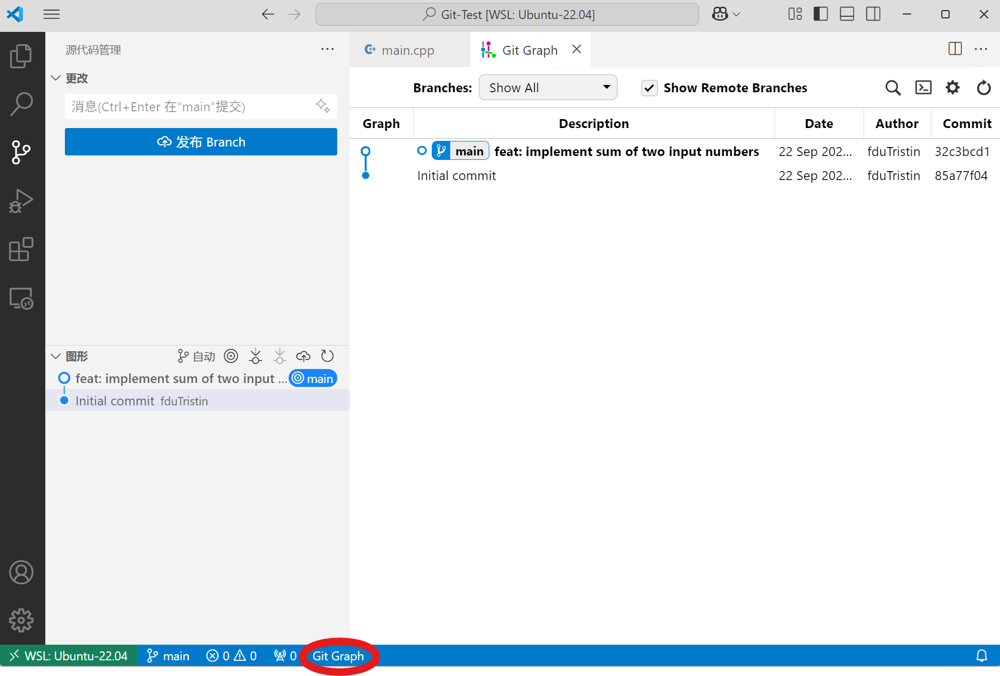

# Lab0: GitLab

## 实验任务

- 下载与安装 Git
- 学习基本的 Git & GitHub 操作
- 加入 GitHub Classroom

## 前言：浅谈版本控制（Version Control）

假设你正在用 C++ 实现一个简易的学生成绩管理系统：

```shell
StudentGradeManagementSystem/
├── main.cpp
├── include/
│   ├── student.h
│   └── grade.h
├── src/
│   ├── student.cpp
│   └── grade.cpp
├── tests
│   └── test.cpp
└── docs/
    └── README.md
```

某一天，你灵机一动：如果我用 `unordered_map` 代替 `vector` 组织学生列表，这样查找某个学生的时间复杂度就从 $O(n)$ 降到了 $O(1)$ ，于是你开心地将项目重构了一遍。过了几天，当你想要将学生按照成绩排序时，你觉得应该改回 `vector`，但之前的文件已经被覆盖了，你不得不再重写一遍。

或许有同学养成了代码备份的好习惯——将重构前的文件保存为 `student_old.h`、`student_old.cpp`等等。但当类似的情景再次发生时，你的项目结构将变得相当混乱。

另一种情景是，假设你和 Zecyel 同学在协作这个项目，你们同时修改了 `main.cpp`，合并的时候只能将代码逐行对比，将他的部分代码复制进来。

### 什么是版本控制？

**版本控制（Version Control）** 是一种系统，用来 **记录文件内容的变化**，并且能在以后 **回溯到特定的版本**。

就像「保存历史记录」一样，它能帮我们：

- 保存每次修改（而不是只保留最新版本）
- 查看每次修改了什么
- 回退到任意一次修改
- 多人协作时合并修改

> [!note]
>
> - 你可以查看我们课程网页仓库的 [commit 历史](https://github.com/ICS-25Fall-FDU/ICS-25Fall-FDU.github.io/commits/main/)，这里记录了我们的每一次修改。
>
> - 我们在生活中使用软件的版本号（例如 `v1.98.2`）则是 **「发行版」**。
>   - 例如我们使用的校园助手 App，在历经界面优化、接口修复等多次修改形成一个稳定、完整的版本后，才会打上标签（tag）发行。

## Git

Git 是一种 **分布式版本控制软件**。

### 下载与安装

- [Windows](https://git-scm.com/downloads/win)

- [macOS](https://git-scm.com/downloads/mac)

- [Linux](https://git-scm.com/downloads/linux)

> [!tip]
>
> - 本学期的大部分实验都在 Linux 系统上完成，使用 Windows 系统的同学请在虚拟机安装 Git，使用服务器的同学请在服务器上安装 Git。
> - 检查安装是否成功。在虚拟机 / 服务器上输入 `git --version`，如果输出 `git version <版本号>`，则为安装成功。

### 配置

在 Git 中，`git config` 是用来 **配置 Git 行为和环境** 的命令。

> [!important]
>
> Git 每次提交都会记录“作者是谁”，需要配置用户名和邮箱：
>
> ```bash
> git config --global user.name "用户名"
> git config --global user.email "你的邮箱@example.com"
> ```

::: details
Git 的配置分为三个层级：

- 系统级（--system）：对整个系统所有用户生效，配置写在 `/etc/gitconfig`

- 用户级（--global）：对当前用户生效，配置写在 `~/.gitconfig`

- 项目级（默认）：仅对当前仓库生效，配置写在 `.git/config`

（优先级：项目级 > 用户级 > 系统级）

在本学期实验中，使用 `--global` 即可。

其他的 Git 配置（可选）：

```bash
# 默认分支名
git config --global init.defaultBranch main

# 别名

# 用 st 代表 status，以下类似 
git config --global alias.st status

git config --global alias.co checkout
git config --global alias.br branch
git config --global alias.cm "commit -m"

```

:::

### Git 基本操作

想要完全掌握 Git 的使用并不是一件轻松的事，但在本学期的实验中并不会遇到非常复杂的场景，因此我们只需掌握以下操作即可。

- `git init`

  将本地项目初始化为一个 Git 仓库。如果你打开项目文件夹，会发现多出了一个 `.git` 文件夹。

- `git add`

  将指定的改动添加到暂存区，例如：

  ```bash
  # 假设你处于 `/StudentGradeManagementSystem` 目录下

  # 将 src 目录下的 student.cpp 添加到暂存区
  git add src/student.cpp

  # 将当前目录下（及其递归子目录）的所有改动添加到暂存区
  git add -A

  # 将当前目录下的所有后缀为 .cpp 的文件改动添加到暂存区（git add 支持字符串通配符）
  git add *.cpp
  ```

  > [!warning]
  >
  > 请一定注意你所在的目录！如果你在 `/src` 目录下执行 `git add -A`，那么 `/StudentGradeManagementSystem` 目录下其他的改动不会被添加到暂存区。
  >
  > ```bash
  > # 只暂存 /src 目录下的改动
  > user@linux:~/StudentGradeManagementSystem/src$ git add -A
  >
  > # 暂存整个项目的改动
  > user@linux:~/StudentGradeManagementSystem$ git add -A
  > ```

- `git commit`

  将暂存区的内容提交到本地仓库。

  `git commit` 一般有两种方式。

  1. `git commit -m "your commit message"` 直接在命令行写 commit message。
  2. `git commit` 执行后 Git 会打开默认编辑器，在这里可以写多行 commit message，适合对一次复杂的提交作详细描述。

:::tip
VS Code 原生集成了 Git，同时提供了一系列插件，例如 Git 提交树可视化插件 Git Graph。
  :::details
  以下是在 VS Code 中使用 Git 的演示：

1. 创建一个空文件夹 `Git-Test`。
2. 点击左侧边栏中的 `源代码管理` 图标。
  

3. 点击 'Initialize Repository'（这一步等同于 `git init`）。
4. 新建 `main.cpp`，会出现 `U` 标记，意为 `Untracked（未跟踪的）`。
  

5. 回到 `源代码管理` 界面，这里有两个 `+` 按钮。
上方的 `+` 代表将项目中的所有更改添加到暂存区，相当于在项目目录下执行 `git add -A`。
下方的 `+` 代表将指定文件添加到暂存区，相当于执行 `git add main.cpp`。
  

6. 点击上方的 `+`，`main.cpp` 的标记变为 `A`，意为 `Added（已暂存）`。
  

7. 在文本框输入 commit message（可以是多行），点击提交，相当于执行 `git commit -m "Initial commit"`
  

8. 修改 `main.cpp`。这时 `main.cpp` 的标记会变为 `M`，意为 `Modified（已修改）`
  

9. 重复上述暂存、提交操作。
  

10. 点击下方的 `Git Graph`，可以查看 Git 提交树。
  

:::
