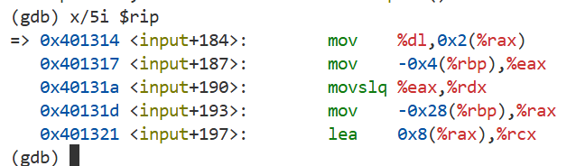
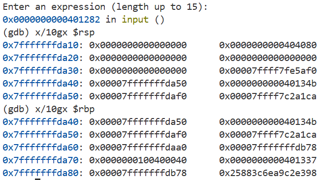
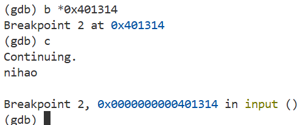
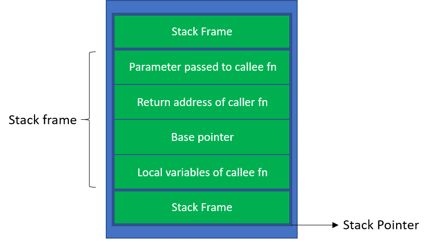
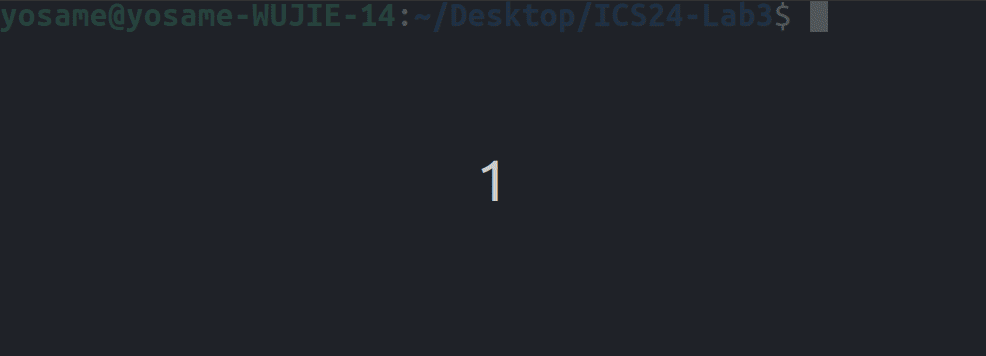

# Lab3: FlowLab

> Deadline：2025-11-11 23:59:59

## 〇、实验简介

### 实验简介

栈帧与程序控制流相关实验。

本学期，我们仍然将金老师 ICS 第三个 Lab 回炉重造，减轻代码工作量并添加更多讲解和提示，以加深各位同学对栈帧和程序控制流的理解，并探索协程的应用，最后从宏观角度思考程序控制流的发展，丰富同学们的知识面。

本次Lab由五个部分组成，含四个主题：

- 尝试在含有漏洞的程序中实现**任意代码执行**
- 学习 Canary 机制，了解栈溢出的**防御**
- 在栈帧基础上探索更多有意思的功能，如**协程**
- 从高处思考程序**控制流**的运行

> [!tip]
>
> 本实验中需要经常使用 GDB 动态调试程序查看栈帧变化，以下是一些常用指令提示：
>
> - `x/5i $rip`：以汇编指令形式查看当前指令及后续 4 条指令
>   - 
> - `x/10gx $rsp`：以十六进制形式查看当前栈顶及后续 9 个栈位置的值
>   - 
> - `b *[address]`：直接在指定地址处设定断点（例如 `b *0x401000`）
>   - 

## 一、危险的计算器

### RCE 攻击

电影中的黑客神通广大，能神不知鬼不觉地“黑”掉各种计算机系统，他们是如何做到的？

首先，我们需要认识一下“黑”掉一个系统到底是指什么，对于黑客来说，有许多种不同的攻击效果（或者说漏洞）：

- RCE (Remote Code Execution)：远程代码执行，即攻击者可以在远程服务器上执行任意代码；
- DoS (Denial of Service)：拒绝服务，即攻击者可以让服务器无法正常工作；
- MITM (Man-In-The-Middle)：中间人攻击，即攻击者可以在通信过程中窃取信息；
- ……

其中，攻击者最为喜闻乐见的就是 RCE ，因为这意味着他们可以在服务器上执行任意程序代码，做任何自己想做的事。比如，他可以把网站服务器托管的网站的首页改成自己的名字；又比如，他可以在上面运行自己的挖矿程序，借用他人计算机的算力帮自己牟利。

一个最简单的RCE漏洞形如：

```c
read(0, input, 20);
system(input);
```

这段代码读取用户输入，并调用了 `system` 函数。`system` 函数的功能是执行一条 shell 指令，比如 `system("ls")` 就会相当于在命令行上输入 `ls` 以显示当前目录下的文件。

这个程序在本地运行时，显然没什么问题，但如果这个 input 字符串来源于网络，这意味着攻击者可以通过输入恶意指令来执行任意代码。比如，当类似于这段代码的程序运行在一个服务器上时，攻击者只要想办法控制 input 为 `rm -rf /` 就可以删除服务器上的所有文件。

所以，RCE 通常就是指“在目标机器上执行任意 shell 指令”。

### 栈溢出漏洞

栈溢出漏洞是一种常见且经典的漏洞，破坏力非常强大——它经常可以使攻击者达成 RCE。

栈溢出漏洞在 C 语言当中非常常见，主要是因为使用 C 语言时非常容易漏掉对数组边界和 buffer 大小的检查。比如，下面这段代码：

```c
char buffer[20];
gets(buffer);
```

这段代码使用了 `gets` 函数，它会读取用户输入并存储到 `buffer` 中。然而，`gets` 函数并不会检查用户输入的长度，如果用户输入的长度超过了 `buffer` 的大小，就会导致多余的数据“溢出”到栈上的其他位置，导致其他数据被干扰。这就是栈溢出的定义。

### 从栈溢出漏洞到劫持程序控制流

之所以栈溢出漏洞如此危险，是因为它可以被利用来劫持程序的控制流。我们来回忆一下，栈上有哪些数据？



注意到，其中有一个重要的数据：返回地址。当函数调用结束时，程序会跳转到这个返回地址继续执行。

如果攻击者栈溢出的数据控制了这个返回地址，他就可以决定程序接下来返回到哪里，从而控制程序的执行流程。

“决定程序接下来执行哪个函数”，这听起来是不是很像我们之前说的 RCE？没错，这就是栈溢出漏洞的危险之处：它可以被利用来实现任意代码执行。试想，如果程序中存在一个调用 `system("/bin/sh")` 函数的地方，我们只需要把对应的地址填到栈上返回地址的位置，就可以控制程序去调用 `system("/bin/sh")`，从而获取一个 shell 达成 RCE。

- 注意，我们不一定要控制程序去返回到某个函数（的起始位置），而**可以控制程序返回到某个函数的中间**。如果有这样一个函数：

```c
void foo() {
    if (false) {
        system("/bin/sh");
    }
    return;
}
```

看上去这个函数没有任何用。但其中包含的 `system("/bin/sh")` 片段可以为我们所用：我们可以直接控制程序执行 if 内的代码。

### 实验

在本次试验中，我们给出了一个简单但包含有漏洞的计算器程序，它会读取用户输入的表达式，包上 `echo $(())` 后调用 `system` 函数来计算表达式的结果。

> [!NOTE]Task 1.1 (10 pts)
>
> 你的任务是：利用栈溢出漏洞，控制程序执行 `./malware` 。这个“恶意程序”会检测自己的父进程调用，如果发现自己由 `dark-calc` 调用，就会输出 `You have successfully detonated the bomb! Congratulations!`，表示你已经成功完成了任务。

#### 实验步骤

1. 阅读 `dark-calc.c` 源代码，理解程序的逻辑，找到漏洞所在函数，计算出溢出所需要的字符数；
2. 使用 `gdb` 调试程序，将断点设置在漏洞所在函数的 `ret` 语句处，观察此时各个寄存器的值；
3. 结合你的观察，使用 `payload.py` 构造一个恰当的 payload，使得通过 `dark-calc` 程序执行 `./malware`。 **`payload.py` 作为自动评分依据。**

#### 提示

- 不同输入函数的“截断”不同，截断指的是输入函数在读取到哪些字符时会停止读取。比如，`gets` 函数会读取到换行符为止，所以它也会读入 `\0` 这种非常特殊的字符。具体可以参照 [CTF中常见的C语言输入函数截断属性总结](https://xuanxuanblingbling.github.io/ctf/pwn/2020/12/16/input/)

- 一个示例的构造 payload 的方法：

    假设 buffer 距离返回地址的偏移为 0x10 ，且我们想让程序返回到地址 `0x4005d6`，则我们可以编写一个如下的 Python 程序：

    ```python
    import sys
    payload = b'A' * 0x10 + b'\xd6\x05\x40\x00\x00\x00\x00\x00'
    sys.stdout.buffer.write(payload)
    ```

    此程序中，我们将输入的前 16（0x10）个字符设为无意义字符 'A'，使缓冲区溢出后的返回地址被覆盖成由**小端法**表示的地址 `0x4005d6`。

    然后在终端中执行：

    ```bash
    python3 payload.py | ./dark-calc
    ```

    或者直接将 payload 写入文件，然后使用重定向机制：

    ```bash
    python3 payload.py > payload
    ./dark-calc < payload
    ```

    后者可以帮助你在使用 GDB 调试时更好地调试，比如在 GDB 中执行 `run < payload` 就可以使用终端的重定向语法。

- 额外补充一个小技巧：在 system（或是命令行shell）中，你可以使用 `#` 符号注释掉不需要的内容。比如，`system("echo hello # echo world")` 只会输出 `hello`，而不会输出 `world`。

> [!tip]
>
> cmd 字符串对应地址处的值在输入完后不变。
>
> 我们的目标类似于执行 `system("./malware")`，如果你已经构造成功了 payload 使程序执行 `system("./malware")`，但程序在 `system` 函数的内部崩溃了，这在我们的预期内。**也就是说，只需要见到 `You have successfully detonated the bomb! Congratulations!` 这一行就算通过实验。**
>
> 造成这种情况的原因是：`system` 内部某些汇编语句对栈的对齐要求很高，如果没有对齐至 0x10，就会导致程序崩溃。如果你使用 GDB 进行调试，你就可以看到这几条非常“挑剔”的汇编指令。
>
> 在正常执行一个函数时，`rsp` 寄存器是向 0x10 对齐的；调用某一个函数时使用的是 `call` 指令，会往栈上压入一个 8 字节的返回地址（这里就破坏了对齐），然后跳转到函数的起始位置。因此，每个函数都会假设自己刚刚被调用时，`rsp` 寄存器是不向 0x10 对齐的。
>
> 然而，我们通过劫持返回地址调用某个函数时，我们并没有使用 `call` 指令，而是直接跳转到了函数的开头。这就导致函数开始时，栈反而向 0x10 对齐了，这破坏了 `system` 函数的假设，导致程序崩溃。
>
> 解决办法很简单：不要直接调用 `system` 函数，而是调用一个中间函数，并且跳过函数开头的一条 `push rbp` 指令。这类似于手动破坏栈的对齐，使得 `system` 函数可以正常执行。

### 实验之后的思考题

> [!NOTE]Problem 1.1 (5 pts)
>
> 除了在报告描述你的攻击流程之外，你还需要在报告中回答以下问题：实验任务中导致溢出的函数早就成为了一个臭名昭著的函数，现如今几乎没有人会再使用它。但即使在 2025 年的今天，我们依然会看到许许多多的栈溢出、堆溢出漏洞。请你思考一下，还有什么其他的场景、函数会导致溢出？你自己是否在编程中遇到过栈溢出的情况？

## 二、更危险的计算器

### 在劫持了程序控制流之后

聪明的你可能会问：并不是所有的程序都会调用 `system("/bin/sh")` 或是类似的函数，这种情况怎么办呢？我们现在仅仅能够控制程序接下来执行哪个地址的代码，离执行任意的 shell 指令还有一段距离。

这个时候就需要进行“构造”了，攻击者在利用漏洞时，需要利用好一切可以利用的资源，包括但不限于：当前寄存器中的数据、内存中的机器码和数据等等。

比如，我们知道 `rdi` 寄存器是用来传递第一个参数的寄存器。如果我们劫持程序控制流到 `foo(int a)` 函数，其实就相当于调用了 `foo(<当前rdi值>)`。

### 在栈空间执行简易的恶意程序

如果尝试过在 GDB 中通过 `x/10gx $rip` 查看当前程序的指令，我们会发现程序存储在内存中的机器码形式和栈上的数据是相似的。那么，有没有可能通过劫持控制流进入栈空间，将栈上的数据看作代码来执行呢？

如今的默认编译选项下，栈空间，以及任何在程序执行过程中可能被改变的内存区域是**不可执行**的，这意味着我们通过劫持控制流进入栈空间后，会触发报错机制，结束程序。

但是存在漏洞，使得我们可以编译出栈空间可执行的程序（参照[这篇文章](https://mp.weixin.qq.com/s/D43kHb5_b0U9EPt_dA4p7g)）。

很不幸的是，上述危险的计算器的编译过程存在这样的漏洞，使这个计算器变得更加危险了。这意味着我们可以利用漏洞，在栈空间执行自己编写的简易汇编程序，例如修改一些寄存器的值之后跳转到其他地方。

### 实验任务

> [!NOTE] Task 2.1 (10 pts)
>
> `dark-calc` 有一个未使用的 `grade_eval` 函数。尝试在阅读代码后，通过 `payload_dark.py` 构建新的 payload，**在 GDB 中**导入到程序 `dark-calc` 执行 `grade_eval`，输出大家理想的成绩！**提交 GDB 运行结果截图（有输出语句 `Hope A will be your grade!` 即可）与 `payload_dark.py` 作为评分依据。无自动评分。**

> [!tip]
>
> 可以用与 Task 1.1 相似的方法保存 payload 并进行调试。
>
> 在 GDB 中，默认程序的栈空间位置在**一次重启期间**固定。
> 我们需要在栈空间内执行代码，期望效果是**赋值输入参数**并**调用函数**。
>
> 大家学过 CSAPP，打过 BombLab，想必对常用 x86-64 汇编指令的机器码有一些了解，此处给出 mov 和 jmp 指令的机器码参考：
>
> - `mov $imm, %rxx` （64 位立即数移动，占 7 字节）：`48 c7 [Mod+Reg+R/M](1 byte) [imm](4 byte)`
>   - `Mod` 指定寄存器模式（2 位，`11` 为寄存器寻址）
>   - `Reg` 源操作数（3 位，这里是立即数，所以置为 0）
>   - `R/M` 指定目标寄存器（3 位）；
> - `jmp *%rxx` （跳转到 `rxx` 寄存器指向的地址，占 2 字节）：`ff [Mod+Reg+R/M](1 byte)`
>   - `Mod` 指定寄存器模式（2 位，`11` 为寄存器寻址）
>   - `Reg` 设为 `100` 指定此指令为 `jmp` 指令（3 位，此处代表指令模式选择值）
>   - `R/M` 指定目标寄存器（3 位）；
>
> <s>善用人工智能工具编写汇编/机器代码（逃</s>

## 三、栈溢出的防御

有一种针对于栈溢出的防御机制被广泛部署于各种软件中，也早已被作为编译器的**默认选项**。

在这个任务中，我们需要你重新编译 `dark-calc.c`，通过阅读汇编代码的方式，理解这种防御机制的原理。

你可以使用这条指令来重新编译一个 `dark-calc-my`：

```bash
gcc -fno-pie -no-pie -o dark-calc-my dark-calc.c
```

在编译以后，你可以通过两种方式来探索这种防御机制：

1. 借助 GDB 动态调试，使用刚刚的 payload 攻击程序，观察程序的行为；
2. 借助 objdump 静态分析，观察程序新增加的汇编代码，通过搜索等手段理解其意义。

你需要尝试回答两个问题：

> [!NOTE]Problem 3.1 (5 pts)
>
> 在实验报告中**描述你对这种防御机制原理的理解**。这种防御机制是否能够彻底“防御”栈溢出漏洞？

> [!NOTE]Problem 3.2 (5 pts)
>
> 尝试根据资料复原出之前实验中 `dark-calc` 的编译指令。

> [!tip]
>
> 通过**特定命令行参数**，可以不开启防御机制；
>
> 为触发可写栈空间漏洞，编译时包含了额外文件，不仅包含 `dark-calc.c`。

## 四、栈帧的更多应用——协程

> 改编自 2024 StackLab 的第三部分（源于 2022 年 Kieray Lab），减少协程部分的代码工作量，替换为阅读思考题。

在前两项任务中，我们已经加深了对程序运行时的栈帧的认识，接下来，我们使用栈帧和一定的汇编语言，来给 C 语言实现一些更加现代的功能吧。

在本实验中，你可以在 coroutine 文件夹下，使用 `make clean && make` 来编译代码，使用 `./program` 来运行代码。

> [!warning]
>
> 本实验中，各测试**默认注释掉**，需手动删除 `main.cpp` 中的注释符号来开启；
>
> 提交时，请留下你能通过的测试，**将其他测试注释掉，否则会影响评分**。

### 前言

> [!tip]
>
> 在本实验中，你并不需要清晰地知道进程和线程的区别。你可以理解为一个进程可以开启多个线程，让 CPU 的不同核心同时计算不同的功能。

如果在程序运行的过程中，我们直接将 PC（%rip）的值修改到某个指定地址，那程序大概率是不能正常运行的。比如我们尝试编译这样一个简单的二分查找 C 语言程序：

```C
#include <stdio.h>
int arr[] = {1, 2, 3, 5, 8, 13, 21, 34};

int binSearch(int dest){
    register int l=0, r=7;
    register int result = -1;
    while(l<=r){
        int mid = (l+r)>>1;
        if(arr[mid]<dest)l=mid+1;
        else if(arr[mid]>dest)r=mid-1;
        else {
            result = mid;
            break;
        }
    }
    if(result == -1) result = l;
    return result;
}

void main(){
    for(int i=0; i<=35;++i){
        printf("%d ", binSearch(i));
    }
    printf("\n");
}
```

它的main函数反汇编后如下：

```asm
0000000000001202 <main>:
    1202:	f3 0f 1e fa          	endbr64 
    1206:	55                   	push   %rbp
    1207:	48 89 e5             	mov    %rsp,%rbp
    120a:	48 83 ec 10          	sub    $0x10,%rsp
    120e:	c7 45 fc 00 00 00 00 	movl   $0x0,-0x4(%rbp)
    1215:	eb 21                	jmp    1238 <main+0x36>
    1217:	8b 45 fc             	mov    -0x4(%rbp),%eax
    121a:	89 c7                	mov    %eax,%edi
    121c:	e8 48 ff ff ff       	call   1169 <binSearch>
    1221:	89 c6                	mov    %eax,%esi
    1223:	48 8d 3d da 0d 00 00 	lea    0xdda(%rip),%rdi        # 2004 <_IO_stdin_used+0x4>
    122a:	b8 00 00 00 00       	mov    $0x0,%eax
    122f:	e8 3c fe ff ff       	call   1070 <printf@plt>
    1234:	83 45 fc 01          	addl   $0x1,-0x4(%rbp)
    1238:	83 7d fc 23          	cmpl   $0x23,-0x4(%rbp)
    123c:	7e d9                	jle    1217 <main+0x15>
    123e:	bf 0a 00 00 00       	mov    $0xa,%edi
    1243:	e8 18 fe ff ff       	call   1060 <putchar@plt>
    1248:	90                   	nop
    1249:	c9                   	leave  
    124a:	c3                   	ret    

```

> [!NOTE]Problem 4.1 (2 pts)
>
> 在运行 main 函数时，内存 -0x4(%rbp) 处是什么？ 1217 位置的 mov 语句是为了做什么？

> [!NOTE]Problem 4.2 (2 pts)
>
> 二分查找函数中我们使用了 `register int` 保留字，这告诉编译器要把变量存到寄存器而不是内存中，这样做有什么好处<sup>1</sup>？正因如此，在执行完二分查找函数中的**算法部分**，希望返回主函数时，能否直接修改 %rip 的值到 1221 而不做其他事情？还缺少什么步骤？

> [1]实际上在现代编译器中，你不需要自己手写 register 关键字。开启优化后，编译器会自动安排变量的位置，找到最优化的一种策略，这基本是现代编译器必备的操作。

### 上下文保存与恢复

打开 Linux 终端，输入 `top -H` 指令（按下 q 退出），看看当前电脑上正在运行的线程有多少个？再输入 `cat /proc/cpuinfo | grep processor`，看看你的电脑的CPU有多少个线程？

在大部分情况下，系统中正在运行的线程数量都比 CPU 的线程数要多，但是你可以试试播放同时多个视频、音频、下载文件、编辑文档、微信接收消息、显示动态壁纸…… CPU 可以“同时”做到这些事情。想要实现这个效果，自然不能让一个程序线程独占一个 CPU ，也就是——限制线程能连续在 CPU 上运行的时间，时间用完后**切换**到一个其它的线程继续运行。只要这个连续运行时间足够短，在我们看起来，电脑就是在同时进行所有工作。

上面这段文字暗含了一些信息：电脑需要保存一个线程“**执行到什么状态了**”，这样它下次继续运行该线程时可以直接从暂停的位置继续。我们将这个**执行的状态**称之为**上下文**，这两种操作分别称为**保存上下文**和**恢复上下文**，记为 save 和 restore 。本实验我们将这些操作限制在同一个进程内，同学们不需要考虑硬件和操作系统层面的内容。

> [!NOTE]Problem 4.3 (2 pts)
>
> 结合 Problem 4.2，为了让程序能在跳转到指定位置后正常运行，我们除了修改 %rip ，还需要复原__(请在报告中填空)__的状态。所以，save 操作需要将这些信息记录到内存中。

我们在这里规定 save 操作不记录函数的栈帧。想象一下用户在函数中申请了一个 16MB 的数组，如果 save 记录栈帧，一次调用就需要将整个数组都复制一遍，低效且浪费空间。

实际上，对于当前 save 和 restore 的定义，我们还有两个需要考虑的方面。对于如下的伪代码：

```pseudocode
funcA:
    x = 0
    save()
    x = 1
    call funcB

funcB:
    restore()
```

> [!NOTE]Problem 4.4 (2 pts)
>
> 在实验报告中填写你的答案：假如变量 x 被存放在栈帧上，在 restore 操作后，x 的值为 ________________ ；假如变量 x 被存放在寄存器上，在 restore 操作后，x 的值为 ________________ 。

由于变量放在寄存器还是内存是由编译器决定的，根据编译器策略的不同，可能会导致同一份代码产生不同的运行结果。为了简化问题，我们可以做出如下限定：在 save 语句后修改过的局部变量，在 restore 操作后都是未知的，让开发者不要在 restore 之后直接使用这些变量的值。

此外还有一个问题。我们可以模拟这个过程：程序首先在 funcA 中 save 一次，调用 funcB，restore 后程序复原到 save 时的状态，又回到 x=1 这条指令。接下来程序又调用 funcB，又执行一次 restore，这显然不是我们所期望的。

为了避免这种“死循环”，我们可以给 save 添加一个“返回值”：正常 save 函数返回0，程序继续向后执行；而执行 restore 后，程序的执行位置同样会回到 save 的后一条语句，其表现也像是“在 save 后返回到该函数”，只需要让此时 save 的返回值**表现为非0**（想一想，函数返回值的本质是什么？），就能区分开 save 和 restore 。甚至，为了让该功能更加实用，还能用一些枚举值来表示“程序为什么调用了 restore”。

```pseudocode
funcA:
    x = 0
    if save() == 0:
        x = 1
        call funcB
    else:
        return

funcB:
    restore()
```

接下来，我们将通过汇编实现 save 和 restore 的功能（显然，不考虑汇编和调用库函数的纯 C 语言难以实现这个功能），不过在此之前我们先着手用汇编语言写一个简单的函数吧。

> [!NOTE]Problem 4.5 (5 pts)
>
> 请用不超过5条汇编指令<sup>2</sup>实现函数 naive_func，直接写在实验报告中。该函数的功能为：将函数的返回地址保存到第一个参数所指定的内存地址，然后返回 0。可参考伪代码：

```pseudocode
naive_func(void **p):
    *p = (return addr);
    return 0;
```

> [2]不计伪指令。如果可以，请在函数开头加上 `endbr64`，正确做法下指令数量是足够的。

> [!NOTE]Problem 4.6 (2 pts)
>
> 也许你在课上学过函数开头两条指令的固定格式 `push rbp; mov rbp, rsp`。但是前面所写的 naive_func 显然不遵循这样的格式，为什么这是可以的呢？

接下来，我们开始着手实现 save 和 restore 函数，为了实现更多后续功能，这两个函数的定义与上文所述有略微不同，请参见 API 手册。

> [!NOTE]Task 4.1 (8 pts)
>
> 请在 `context_asm.S` 中实现函数 `__ctx_save` 和 `__ctx_restore`，分别对应上文所述的 save 和 restore 操作。根据函数的定义，你需要仔细考虑哪些数据是需要存储到 `__ctx` 中的。你可以自行调整 `__ctx` 类型申请的内存大小，但是我们保证原始代码给出的120字节是足够的。如果一切顺利，在完成本节内容后，你将能通过 test1 和 test2。

> [!tip]
>
> 按照 x86-64 调用约定，rdi 和 rsi 分别为函数调用的第一二个参数，rax 为函数调用的返回值。在默认情况下，gcc 使用 AT&T 汇编语法。如果你想要使用 Intel 汇编语法，可以在 ctx.S 的开头加上一句 `.intel_syntax noprefix`。
>
> 禁止使用 setjmp、longjmp 或 __builtin_setjmp 等现成函数，但你**可以参考它们的实现**。

### 基于上下文回退的异常处理

现代编程语言基本都支持异常处理机制，即程序包含以 try 和 catch（或 except 等关键字）开头的代码块，程序员可以将一些代码放到 try 代码块中，如果遇到除0错误或是其他一些错误，程序不是直接停止运行，而是跳转到 catch 后面继续运行。

基于上一部分已经实现的两个操作，我们可以实现一个简单的异常处理机制，不妨参考下面的伪代码：

```pseudocode
func():
    x = input
    if save() == 0:
        check(x)
        print(input / 2)
    else:
        print("Input is invalid")

check(x):
    if not isdigit(x):
        recover(error_code)
```

这实际上等同于使用 try-catch 机制，它和下面的 Python 代码是基本等价的：

```python
def func():
    x = input()
    try:
        check(x)
        print(int(x) / 2)
    except:
        print("Input is invalid")

def check(x):
    if not x.isdigit():
        raise Exception("Input is invalid")
```

借助 C 语言的宏，我们可以将原始含 save 和 recover 的代码包装成类似 Python 或者 C++ 风格的代码。而且，try-catch 是可以嵌套的。在发生 try-catch 嵌套时，程序中会同时存在许多个 try 记录的上下文。在执行 throw 操作时，我们需要恢复到最新的一个上下文，如下面的 C++ 代码：

```C++
try{
    try{
        throw Exception;
    }
    catch{
        cout << 1;
    }
}
catch{
    cout << 2;
}
```

该代码会输出 `1`。

容易看出，这实际上就是一个栈的结构，我们将其称为异常处理栈。对于每个 try 操作，它记录当前的上下文，并将其加入异常处理栈。对于每个 throw 操作，它弹出异常处理栈中的栈顶元素，将当前状态恢复成该上下文，并转而执行 catch 操作。当然，清理也是必须的，对于每个正常完成的 try 操作，我们需要弹出异常处理栈中的栈顶元素，使之恢复到 try 操作之前的状态，如下面的代码则会输出 `2`：

```C++
try{
    try{
    }
    catch{
        cout << 1;
    }
    throw Exception;
}
catch{
    cout << 2;
}
```

在本lab中，我们采用单向链表的方式来实现这个栈。在该 Task 中，你暂时不需要考虑 `__generator` 结构体的作用，只需要知道 `__now_gen->__err_stk_head` 是这个单向链表的表头，`__err_stk_node` 结构体用于表示链表的节点。你需要实现 `__err_stk_push` 和 `__err_stk_pop` 两个函数来实现链表的操作。

> [!NOTE]Task 4.2 (8 pts)
>
> 请在 `context.c` 中实现函数 `__err_stk_push` 和 `__err_stk_pop`。如果一切顺利，在完成本节内容后，你将能通过 test3、test4 和 test5。

> [!tip]
>
> C 语言提供了 cleanup 属性，被添加该属性的变量会在生命周期结束时执行对应的函数，可以理解为类似析构函数的功能，可参考[这里](https://gcc.gnu.org/onlinedocs/gcc/Common-Variable-Attributes.html)。我们实现了 `__err_cleanup` 函数作为对 `__err_try` 执行清理操作的接口。
>
> **可以阅读 `context.h` 中对 `try`、`catch` 和 `throw` 的宏定义**，帮助理解错误处理栈的应用场景，为接下来的 Task 4.3 做准备。

### 基于上下文切换的生成器（协程）

如果你还不熟悉 Python 的生成器，可以试着跑一下以下程序，观察输出：

```python
def test(x):
    val = x
    for i in range(5):
        val = yield val
        print(val)
        val += 1

gen = test(1)
array = [gen.send(None)]
print(array)
while True:
    array.append(gen.send(array[-1]*10))
    print(array)
```

这段代码里面有关键字 `yield` 和方法 `send`：

- 当 `gen` 被赋值为一个函数后，程序并没有执行该函数。
- 而第一次调用 `send` 方法时，程序跳转到该函数的开头开始执行。
- 执行到第一个 `yield` 关键字时，函数将 `yield` 后面的值作为 `send` 方法的返回值，恢复到调用 `send` 的地方继续向后执行。
- 下次 `send` 又被调用时，程序并不是在函数中从头开始，而是接着上次 `yield` 的位置继续向后执行，且 `send` 方法的参数在该函数看来就是 `yield` 的返回值。
- 当 `test` 函数执行完毕后，程序会抛出一个异常。

这似乎跟我们前面实现的保存上下文很像：

- `yield` 保存了函数当前的上下文，返回主函数；
- `send` 保存了主函数的上下文，恢复函数的上下文继续执行。

看起来这个功能似乎很好实现？不过先让我们看看下面的伪代码：

```pseudocode
ctx a, b;

funcA:
    for i in 0..10:
    print("A", i);
    if(save(&a) == 0):
        restore(&b);

funcB:
    for i in 0..10:
    print("B", i);
    if(save(&b) == 0):
        restore(&a)
```

容易看出，如果这段代码已经跑起来了，它可以交替执行 A 和 B 两个循环，只要在此基础上包装出 yield 和 send 函数，即可达到与 Python 中生成器一致的效果。但我们首先要解决一个问题：它是怎么跑起来的？

请注意我们在之前提出的约定：函数返回之后，不能再使用其调用 `save` 保存的上下文。因此，要想使 funcA 中引用的 ctx b 有效，必须保证 funcB 不返回（保证不清除栈帧），这似乎只可能发生在 funcB 调用了 funcA 的情况下。但反过来，要想使 funcB 中引用的 ctx a 有效，也必须保证 funcA 不返回（保证不清除栈帧），似乎只可能发生在 funcA 调用了 funcB 的情况下。

上面的分析仿佛引出了一个悖论。事实上，这一悖论只会在 funcA 和 funcB 使用**同一个调用栈**的情况下成立。

假如我们为 funcA 和 funcB **分配两个不同的栈空间**，那么执行 funcA 时，funcB 的栈帧保留在它自己的栈空间上，与 funcA 所在的栈空间并无关联，也就不需要调用关系来保证 funcB 不返回了。

为了实现多个栈空间，我们可以手动**申请一块内存**，配置一段**自定义的上下文**，然后通过我们实现的 restore 函数来更改寄存器的内容，并让程序跳转到这一段内存开始执行函数，这样这个函数就有了一段独立的栈空间。

总结一下这个过程：创建生成器时，程序申请一段内存，并在该内存中配置一段初始上下文，等待调用。当生成器第一次被调用时，`restore` 到这段初始上下文，程序在你手动配置的返回地址的位置继续执行，从而跳转到生成器对应的函数，直到第一次遇到 `yield`。此时程序保存当前生成器的上下文，返回到调用该生成器的函数中。如果生成器的函数执行完毕，抛出一个 `ERR_GENEND` 异常。

在已给出的 `__generator` 结构体中，我们使用 `data` 变量来传输 `yield` 和 `send` 的参数。为方便起见，我们将程序的主函数也视作一个generator（只不过你不需要手动给这个generator制作一个栈空间和初始上下文），因此全局变量 `__now_gen` 被初始化为了 `&__main_gen`，且每个generator都有自己的异常处理栈。

> [!NOTE]Task 4.3 (5 pts)
>
> 根据自己编写的上下文保存和恢复规则，参照样例解释，实现 `generator` 构造函数的**上下文构建部分**；完成此内容后，你将能通过 test6、test7 和 test8。

> [!NOTE]Problem 4.7 (5 pts)
>
> 请阅读 `context.c` 中的函数 `send`、 `yield`、 `back_to_reality`，`context.h` 中对 `try`、 `catch` 和 `throw` 的宏定义，并在报告中解释这些函数和宏定义的功能。

> [!NOTE]Problem 4.8 (5 pts)
>
> 任选 test6、test7、test8 中的一个，使用 GDB 动态调试，运用 `x/10gx $rsp` 指令查看至少两种不同位置处开始的栈帧或是伪栈帧并截图，体会协程中开辟虚拟栈空间的设计。

### 协程的一些实际应用

协程在现代应用程序中有广泛的应用。比如，手机程序向服务器请求数据时同时显示动画，就可以理解为本机的逻辑处理函数发送网络请求后，上下文恢复到主函数来显示动画，一旦服务器返回了数据，上下文又切换到逻辑处理函数来执行后续操作。这是非常节约资源的一个方法：开辟新线程来进行网络通信也可以达到相同的效果，但开辟新线程本身就会消耗一些系统资源，所以不是最优的选择。

有关协程实现的最后一个部分希望你能自定义一个基于协程的进度条动画。考虑我们平时玩的游戏，游戏画面本身也是多张图片连续快速播放，人眼看起来就变成了连贯的动画，这一过程可以用以下伪代码表示：

```pseudocode
def game():
    record_time = get_time()

    while True:
        now_time = get_time()
        delta_time = now_time - record_time
        record_time = now_time

        get_user_input()
        handle_events(delta_time)
        draw_scene()
        sleep_until_next_frame()
```

其中，`delta_time` 代表游戏两帧之间间隔了多久，游戏场景里面的物件会根据这个时间间隔移动相应的距离。

当需要给某游戏物件做一个持续若干秒的动画时，我们不能在某函数中写一个循环，每次移动一点物体，然后 `sleep` 若干毫秒，循环直到动画结束，这会导致在动画结束前都无法执行到其它代码，会阻碍其他游戏事件的进行。一种解决方法时，开启一个新的协程，每次主函数向协程 `send(delta_time)`，协程就会根据时间变化量少量修改对应物体的坐标，然后 `yield` 回到主函数来执行其它代码，等待下一帧到来，主函数继续 `send`，以此类推，直到动画结束。

> [!tip]
>
> 这是在如 Unity 等游戏引擎中一种典型的通过代码来制作物体动画的方法。

> [!NOTE]Task 4.4 (4 pts)
>
> 基于上面的讨论，请你完善 `main.c` 中的 `progress_bar` 函数，实现一个自定义的进度条动画。发挥你的想象力即可。



## 五、控制流和栈帧的进一步思考

> [!TIP]
>
> 如果你在做 Lab 时候做到了这里，那么恭喜你，你已经完成了 80% 以上的工作，接下来的任务主要是深入的思考和问答。有些问题较为开放，没有标准答案，充分思考回答即可。例如对于问题“为什么需要 Scope Table Ptr？”，回答“我不认为需要 STP，下面是一种更好的实现方法 blablah……”也是可以接受的。希望大家积极思考，放过 LLM，开动自己的脑筋。

### 历史的回顾

回顾一下，这个 Lab 的前一部分到底在做什么？我们为什么需要费时费力地写 `save`/`restore`、`try`/`catch`/`throw`、`yield`……？实际上这是因为，人类的编程思路是跳跃的。我们脑子里在想，“先干什么然后做很多次这个然后如果这样则跳到那里干那个”，但是笨笨的 CPU 只会一条一条执行指令。这就产生了相当大的矛盾。

> [!NOTE]Problem 5.1 (3 pts)
>
> 你知道吗，其实函数式编程语言更加贴近人类的思考过程。你有学过函数式编程语言吗？你能在 AI 的帮助下理解下面的这一段 Haskell 代码吗？你觉得函数式编程语言和过程式语言的区别是什么？请在报告中回答。
>
> ```haskell
> safe :: Int -> [Int] -> Int -> Bool
> safe _ [] _ = True
> safe x (x1:xs) n = x /= x1 && x /= x1 + n && x /= x1 - n && safe x xs (n+1)
> 
> queens :: Int -> [[Int]]
> queens 0 = [[]]
> queens n = [ x:y | y <- queens (n-1), x <- [1..8], safe x y 1]
> ```

为了让计算机能够跟上人类跳跃的思维，我们逐步发明了这些东西：

- 我们往汇编语言里加入了 `JMP`/`JXX`！

    终于不用像计算器那样只能一条一条执行计算了，我们可以撰写更丰富的内容了！

- 我们实现了 `CALL`/`RET`！

    可以编写函数了！代码更加的整齐和规范了！我们现在也有了递归，编写代码更容易了！

- 出现了高级语言，我们可以使用 `if`/`else` 等控制流了！

    终于不用被各种看不懂的 `JMP` 折磨了，程序更易阅读了！

- 引入了异常处理控制流 `try`/`catch`！

    当程序运行出错的时候能更好的追踪错误，让程序继续运行，而不是哐的一下崩溃了！

- 引入了生成器 `generator`/`yield`！

    终于不用让程序干等着了，数据加载器占用的内存也更少了！

- 引入了异步原语 `async`/`await`！

    编写异步代码更加容易了！程序运行吞吐量更高了！

- ……

当然这些概念是无穷无尽的，你也可以发明自己的控制流（只要它 make sense）。当然，就有一门学科专门研究计算机语言的相关理论，不管是新特性、新语法，或者是传统的安全性、执行效率，还是听上去奇奇怪怪的类型论，生命周期理论，都是这门学科所涉及的。这门学科就是“编程语言理论（PL, Programming Language Theory）”。

相信在前面半学期的磨练中，大家对“编程语言”的理解提升了不少，接下来就带大家以 PL 领域学者的视角，重新看一看这个 Lab。

### 异常处理流到底是什么？

在某种意义上，这像是“程序的第二条控制流”，它只有在程序运行产生异常的时候才会被唤起，在运行一段之后又会返回原先的控制流继续运行。在上面的代码中，我们使用了异常处理堆栈和 C Macro 来模拟了这一操作，但是现代的 C++ 编译器却不是这么实现的。

> [!NOTE]Problem 5.2 (4 pts)
>
> 回忆一下内存布局，栈区和堆区的区别是什么？我们的异常处理堆栈在运行时存放在栈区还是堆区？这是好的还是不好的？程序正常运行时的栈帧存放在栈区还是堆区？查阅资料并在报告中回答上述问题。
>
> 相信你在回答完上述问题之后，应该已经清楚为什么现代 C++ 编译器不是像我们这样处理异常控制流了。

事实上，现代的 C++ 编译器（此处特指 GCC 和 Clang），使用了 DWARF 标准，其内部写明了 Itanium C++ ABI 的工作方式。对于有 `try`/`catch` 的函数，会在其栈帧添加“异常处理记录（Exception Registration Record）”。具体如下。

对于一个普通的函数来说，它的栈帧大概是这样的：

```text
    High Address
+-------------------+
| Caller's Frame    |
|-------------------|
| Return Address    |
|-------------------|
| Saved RBP         |
|-------------------|
| Local Variables   |
|-------------------|
| Callee-Saved Regs |
+-------------------+
     Low Address
```

当进入 try 块时，程序会在栈顶压入以下的结构：

```text
+-------------------+
| Next Record Ptr   |
|-------------------|
| Handler Function  |  // 指向异常处理函数（如__gxx_personality_v0）
|-------------------|
| Scope Table Ptr   |  // 指向.tdata/.eh_frame的异常范围表
+-------------------+
```

`Next Record Ptr` 指向上一个记录，从而形成错误处理堆栈。`Handler Function` 指向异常处理函数，而 `Scope Table Ptr` 指向 `.tdata` / `.eh_frame` 的异常范围表。

> [!NOTE]Problem 5.3 (3 pts)
>
> 请仔细阅读实验文档、查阅资料，并在报告中回答问题：为什么需要 `Scope Table Ptr`？如果你查阅了资料依然无法理解，可以尝试在 C++ 中写一个带有异常处理的函数，然后使用 gdb 调试它。

在程序 throw 之后，一些运行时库（例如 libunwind）会自动遍历异常记录链表，然后找到能处理这个异常的函数并进入。对于无法处理这个异常的栈帧，会直接摧毁。举个例子来说，如果 A 函数中 try/catch 了，然后在 try 块中调用了 B 函数，B 函数调用了 C 函数，C 函数 throw 了一个异常，则程序会依次查找异常记录链表，当它找到了 A 函数之后，B 函数的栈帧会自动被摧毁，之后再也无法恢复里面的局部变量等信息了。

> [!NOTE]Problem 5.4 (5 pts)
>
> 请仔细阅读实验文档、查阅资料，并在报告中回答问题：摧毁函数 B 的栈帧是好的吗？在什么情况下是好的？在什么情况下是不好的？为什么异常处理控制流被用作异常处理而不是其它用途（比如它有哪些设计是专门为异常处理而设计的）？
>
> Itanium C++ ABI 的做法有哪些和我们的实验不一样？二者各自的优缺点是什么？

> [!TIP]
>
> 你知道吗，MSVC 编译器会使用不同于 Clang 和 GCC 的异常处理策略，它使用的策略叫做 SEH（Structured Exception Handling），通过 FS:[0] 注册异常回调。

### Honor Part: 代数效应

> [!TIP]
>
> 为了奖励还能咬着牙把 FlowLab 写到 Honor Part 的同学，@Zecyel 写了一个关于异常控制流的小剧场供大家娱乐。
>
> 丰try·祥子: 调用栈已经分崩离析了，绝对不可能复活。
>
> 长崎·raise: 哦内盖，如果不能恢复执行的话，瓦达西……
>
> 长崎·raise: 要怎么做才能回来？只要是我能做的，我什么都愿意做！
>
> 丰try·祥子: 你这个人，满脑子都只想着自己呢。

和其它 lab 的评分标准相同，除去 Honor Part 的内容满分为 100 分，Honor Part 只能用来抵前面报告的扣分和迟交得分。Lab 的分数上限仍为 100 分。

我们回想一下生活中。如果我们正在写作业，接到了一个电话。那我们可以在接完电话之后重新回去写作业。同样的，当 CPU 在执行计算任务时，突然接收到了一个“鼠标点击”事件，那么它也可以在处理完这个事件之后重新回去计算。那么，我们可不可以把这个特性移植到编程语言中呢？

我们回想一下异常处理流，它也有类似的“事件-响应”的范式，但是在响应完成之后不能回到原来的地方继续执行。这其实不难理解，因为异常已经发生了，如果什么都不干，再回去执行大概率还是会遇到相同的异常。而且一般来说我们也不希望它接着运行。

我们先幻想一下，如果可以回去执行，那么我们写代码会变成什么样子呢？

我们把我们的假想的语法叫做 `perform`/`resume`，当我们执行 `perform` 的时候，我们往上找到最近的一个可以接收它的 `handle` 块，然后等待它 `resume`，然后恢复到 `perform` 的时候继续执行。

一个示例代码如下。当程序运行到 `getUsernameById` 时，会唤起 `DatabaseEffect`，然后等待外部把数据库对象给它，然后它再跳转回去恢复执行。从而避免了数据库实例需要一级一级向下传递，产生大量冗余代码和拷贝开销，以及各处使用的数据库实例不一致（比如某个函数中忘记传参数）等各种问题。

```cpp
// 声明效果类型
struct DatabaseEffect {};

std::string getUsernameById(int userId) {
    // 发起数据库连接效果
    auto db = perform DatabaseEffect{};  // 假设返回 DB 连接对象
    
    // 恢复后继续执行
    return db.query("SELECT name FROM users WHERE id=" + std::to_string(userId));
}

int main() {
    try {
        auto username = getUsernameById(123);
        std::cout << "Username: " << username;
    }
    handle (effect) {  // 自定义 handle 语法
        if (effect.isType<DatabaseEffect>()) {
            auto conn = connectDatabase("mongodb://localhost:27017"); // 建立真实连接
            resume conn;  // 将连接对象返回给 perform 处
        }
    }
}
```

以上就是所谓的“代数效应”，我们会把这个例子中的 `DatabaseEffect` 叫做一种“效应”。从函数式的视角来看，我们也会发现，通过这样处理之后，我们的 `getUsernameById` 变成了无副作用的安全代码，实现了“环境”和“计算”的分离。不过可惜的是，目前尚未有主流语言支持了代数效应。

> [!NOTE]Problem 5.5 (Honor: 10 pts)
>
> 请仔细阅读实验文档、查阅资料，并在报告中回答问题：
>
> 你能再举几个代数效应的应用的例子吗？有哪些你在编程中遇到的问题可以使用代数效应更好的解决？
>
> 之所以我们的异常控制流实验不用类似 Itanium C++ ABI 的做法，是因为其实编译器知道更多关于 try/except 的信息，比如它在 try 的时候就知道 except 块的地址是什么，但是我们的实验中不知道，所以只能用宏来实现一个简单类似的功能。
>
> 问，假如你是编译器，你会使用什么策略来编译使用了代数效应的代码？详细阐明你的设计，并论证它是合理。

## 参考资料与鸣谢

- CMU 原版 [Attack Lab](http://csapp.cs.cmu.edu/3e/labs.html)
- 2022年 Kieray Lab，作者 @[虎鲸](https://github.com/zzzly3)
- 本实验参考 2024 年的 StackLab 实验开发，鸣谢24 Fall TA：@[y<sup>2</sup>](https://github.com/Cameudis)、@[Yosame](https://github.com/Yosame08)

> 负责助教：周弈成 @[JurFal](https://github.com/JurFal) 朱程炀 @[Zecyel](https://github.com/Zecyel)
